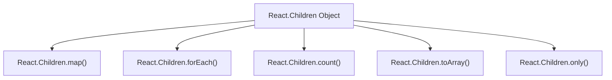

# Utilities

This section details React's utility functions, which assist in managing and transforming component children and accessing environmental information like the React version. These utilities are essential for creating flexible and robust React applications.

For a deeper understanding of fundamental React concepts, including how children are handled within components, refer to the [Core Concepts](./core-concepts.md) section.

## React.Children

`React.Children` is a utility object that provides methods for working with the `props.children` opaque data structure. These methods help safely iterate, transform, or count children elements, especially when they are nested or mixed with primitive values.

Here's an overview of the methods available under `React.Children`:



### map

Iterates over the children with a provided function. This function is called for each child, and the results are collected into a new array. It is particularly useful for transforming or rendering a list of children.

**Parameters**

| Name | Type | Description |
|---|---|---|
| `children` | `ReactNodeList` | The children container (e.g., `props.children`). |
| `func` | `(child: ?React$Node, index: number) => ?ReactNodeList` | The function to call on each child. It receives the child and its index as arguments. |
| `context` | `mixed` | The context (`this`) to bind to `func`. |

**Returns**

| Type | Description |
|---|---|
| `?Array<React$Node>` | A new array containing the results of applying `func` to each child. Returns `children` if it's `null` or `undefined`. |

**Example**

```jsx
import React from 'react';

function MyList({ children }) {
  return (
    <ul>
      {React.Children.map(children, (child, index) => {
        if (React.isValidElement(child)) {
          return <li key={child.key || index}>{child}</li>;
        }
        return <li key={index}>{child}</li>;
      })}
    </ul>
  );
}

function App() {
  return (
    <MyList>
      <span>Item 1</span>
      <span>Item 2</span>
      Just text
      {[<span key="3">Item 3</span>, <span key="4">Item 4</span>]}
    </MyList>
  );
}

// Example usage in a render function:
// ReactDOM.render(<App />, document.getElementById('root'));
```

This example demonstrates how `React.Children.map` can wrap each child of a `MyList` component within an `<li>` element. It handles both React elements and plain text nodes.

### forEach

Iterates over the children with a provided function, similar to `map`, but does not return a new array. It is used for side effects, such as logging or performing actions on each child without modifying them.

**Parameters**

| Name | Type | Description |
|---|---|---|
| `children` | `ReactNodeList` | The children container. |
| `forEachFunc` | `(child: ?React$Node, index: number) => void` | The function to call on each child. It receives the child and its index as arguments. |
| `forEachContext` | `mixed` | The context (`this`) to bind to `forEachFunc`. |

**Returns**

| Type | Description |
|---|---|
| `void` | This function does not return a value. |

**Example**

```jsx
import React from 'react';

function LogChildren({ children }) {
  React.Children.forEach(children, (child, index) => {
    console.log(`Child at index ${index}:`, child);
  });
  return <div>Check console for children details.</div>;
}

function App() {
  return (
    <LogChildren>
      <p>Paragraph 1</p>
      <p>Paragraph 2</p>
      Hello
    </LogChildren>
  );
}

// Example usage in a render function:
// ReactDOM.render(<App />, document.getElementById('root'));
```

This example uses `React.Children.forEach` to log each child of the `LogChildren` component to the console, illustrating a common use case for side effects.

### count

Returns the total number of children in a collection. It counts all leaf children, including fragments or arrays of children, by flattening them.

**Parameters**

| Name | Type | Description |
|---|---|---|
| `children` | `ReactNodeList` | The children container. |

**Returns**

| Type | Description |
|---|---|
| `number` | The number of children. |

**Example**

```jsx
import React from 'react';

function ChildCounter({ children }) {
  const childCount = React.Children.count(children);
  return <p>This component has {childCount} child(ren).</p>;
}

function App() {
  return (
    <div>
      <ChildCounter>
        <span>A</span>
        <span>B</span>
        <span>C</span>
      </ChildCounter>
      <ChildCounter>
        <span>Only one</span>
      </ChildCounter>
      <ChildCounter>
        {/* No children */}
      </ChildCounter>
      <ChildCounter>
        {[<span>1</span>, <span>2</span>]}
      </ChildCounter>
    </div>
  );
}

// Example usage in a render function:
// ReactDOM.render(<App />, document.getElementById('root'));
```

This example demonstrates how `React.Children.count` can determine the number of children passed to a component, regardless of whether they are directly passed or nested within arrays.

### toArray

Converts the `children` opaque data structure into a flat array of React elements, preserving keys if they exist. This is useful when you need to reorder or filter children.

**Parameters**

| Name | Type | Description |
|---|---|---|
| `children` | `ReactNodeList` | The children container. |

**Returns**

| Type | Description |
|---|---|
| `Array<React$Node>` | A flat array of React elements or primitives. Returns an empty array if `children` is `null` or `undefined`. |

**Example**

```jsx
import React from 'react';

function ReversedList({ children }) {
  const childrenArray = React.Children.toArray(children);
  const reversedChildren = childrenArray.slice().reverse();

  return (
    <div>
      <h3>Original Order:</h3>
      {childrenArray}
      <h3>Reversed Order:</h3>
      {reversedChildren}
    </div>
  );
}

function App() {
  return (
    <ReversedList>
      <span>First</span>
      <span>Second</span>
      <span>Third</span>
      {[<span key="4">Fourth</span>, <span key="5">Fifth</span>]}
    </ReversedList>
  );
}

// Example usage in a render function:
// ReactDOM.render(<App />, document.getElementById('root'));
```

This example uses `React.Children.toArray` to convert children into a modifiable array, which is then reversed before rendering, demonstrating dynamic manipulation of children order.

### only

Verifies that a component has exactly one child and returns that child. If there is more than one child, or if there are no children, it throws an error. This is useful for components that strictly expect a single child element.

**Parameters**

| Name | Type | Description |
|---|---|---|
| `children` | `any` | The children collection. |

**Returns**

| Type | Description |
|---|---|
| `T` | The single `ReactElement` from the collection. |

**Example**

```jsx
import React from 'react';

function SingleChildWrapper({ children }) {
  const onlyChild = React.Children.only(children);
  return (
    <div style={{ border: '1px solid blue', padding: '10px' }}>
      {onlyChild}
    </div>
  );
}

function App() {
  return (
    <div>
      <SingleChildWrapper>
        <p>This is the only child.</p>
      </SingleChildWrapper>
      {/* This would throw an error:
      <SingleChildWrapper>
        <p>Child 1</p>
        <p>Child 2</p>
      </SingleChildWrapper>
      */}
      {/* This would also throw an error:
      <SingleChildWrapper>
      </SingleChildWrapper>
      */}
    </div>
  );
}

// Example usage in a render function:
// ReactDOM.render(<App />, document.getElementById('root'));
```

This example uses `React.Children.only` to ensure that `SingleChildWrapper` receives exactly one React element as its child. It would error if multiple children or no children were provided.

## React.version

`React.version` is a string that represents the current version of the React library being used. This can be useful for debugging, logging, or for third-party libraries that need to adapt their behavior based on the React version.

**Returns**

| Type | Description |
|---|---|
| `string` | The version string of the React library (e.g., `'18.2.0'`). |

**Example**

```jsx
import React from 'react';

function DisplayReactVersion() {
  return (
    <p>Current React Version: {React.version}</p>
  );
}

// Example usage in a render function:
// ReactDOM.render(<DisplayReactVersion />, document.getElementById('root'));
```

This example simply displays the current version of React being used in the application.

---

This section provided a detailed overview of React's utility functions, covering methods for children manipulation and version information. These tools are fundamental for building well-structured and adaptable React applications.

To continue exploring React's client-side capabilities, you might want to look into [Server Components APIs](./server-components-apis.md) to understand how React extends its functionality to the server-side, or delve into [Concurrency and Advanced Features](./concurrency-features.md) for optimizing UI updates.