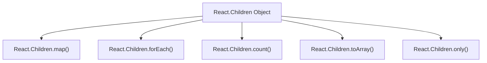

# 实用工具

本节详细介绍了 React 的实用工具函数，它们有助于管理和转换组件的子元素，并访问 React 版本等环境信息。这些实用工具对于创建灵活且健壮的 React 应用程序至关重要。

要深入了解 React 的基本概念，包括组件中子元素的处理方式，请参阅[核心概念](./core-concepts.md)部分。

## React.Children

`React.Children` 是一个实用工具对象，提供了用于处理 `props.children` 不透明数据结构的方法。这些方法有助于安全地迭代、转换或计算子元素，尤其是在它们嵌套或与原始值混合时。

以下是 `React.Children` 下可用方法的概述：



### map

使用提供的函数迭代子元素。该函数针对每个子元素调用，结果收集到一个新数组中。它对于转换或渲染子元素列表特别有用。

**参数**

| Name | Type | Description |
|---|---|---|
| `children` | `ReactNodeList` | 子元素容器（例如，`props.children`）。 |
| `func` | `(child: ?React$Node, index: number) => ?ReactNodeList` | 对每个子元素调用的函数。它接收子元素及其索引作为参数。 |
| `context` | `mixed` | 绑定到 `func` 的上下文（`this`）。 |

**返回值**

| Type | Description |
|---|---|
| `?Array<React$Node>` | 一个新数组，包含将 `func` 应用于每个子元素的结果。如果 `children` 为 `null` 或 `undefined`，则返回 `children`。 |

**示例**

```jsx
import React from 'react';

function MyList({ children }) {
  return (
    <ul>
      {React.Children.map(children, (child, index) => {
        if (React.isValidElement(child)) {
          return <li key={child.key || index}>{child}</li>;
        }
        return <li key={index}>{child}</li>;
      })}
    </ul>
  );
}

function App() {
  return (
    <MyList>
      <span>Item 1</span>
      <span>Item 2</span>
      Just text
      {[<span key="3">Item 3</span>, <span key="4">Item 4</span>]}
    </MyList>
  );
}

// Example usage in a render function:
// ReactDOM.render(<App />, document.getElementById('root'));
```

此示例演示了 `React.Children.map` 如何将 `MyList` 组件的每个子元素包装在 `<li>` 元素中。它处理 React 元素和纯文本节点。

### forEach

使用提供的函数迭代子元素，类似于 `map`，但不返回新数组。它用于副作用，例如记录或对每个子元素执行操作而不修改它们。

**参数**

| Name | Type | Description |
|---|---|---|
| `children` | `ReactNodeList` | 子元素容器。 |
| `forEachFunc` | `(child: ?React$Node, index: number) => void` | 对每个子元素调用的函数。它接收子元素及其索引作为参数。 |
| `forEachContext` | `mixed` | 绑定到 `forEachFunc` 的上下文（`this`）。 |

**返回值**

| Type | Description |
|---|---|
| `void` | 此函数不返回值。 |

**示例**

```jsx
import React from 'react';

function LogChildren({ children }) {
  React.Children.forEach(children, (child, index) => {
    console.log(`Child at index ${index}:`, child);
  });
  return <div>Check console for children details.</div>;
}

function App() {
  return (
    <LogChildren>
      <p>Paragraph 1</p>
      <p>Paragraph 2</p>
      Hello
    </LogChildren>
  );
}

// Example usage in a render function:
// ReactDOM.render(<App />, document.getElementById('root'));
```

此示例使用 `React.Children.forEach` 将 `LogChildren` 组件的每个子元素记录到控制台，说明了副作用的常见用例。

### count

返回集合中子元素的总数。它通过扁平化子元素来计算所有叶子子元素，包括片段或子元素数组。

**参数**

| Name | Type | Description |
|---|---|---|
| `children` | `ReactNodeList` | 子元素容器。 |

**返回值**

| Type | Description |
|---|---|
| `number` | 子元素的数量。 |

**示例**

```jsx
import React from 'react';

function ChildCounter({ children }) {
  const childCount = React.Children.count(children);
  return <p>This component has {childCount} child(ren).</p>;
}

function App() {
  return (
    <div>
      <ChildCounter>
        <span>A</span>
        <span>B</span>
        <span>C</span>
      </ChildCounter>
      <ChildCounter>
        <span>Only one</span>
      </ChildCounter>
      <ChildCounter>
        {/* No children */}
      </ChildCounter>
      <ChildCounter>
        {[<span>1</span>, <span>2</span>]}
      </ChildCounter>
    </div>
  );
}

// Example usage in a render function:
// ReactDOM.render(<App />, document.getElementById('root'));
```

此示例演示了 `React.Children.count` 如何确定传递给组件的子元素数量，无论它们是直接传递还是嵌套在数组中。

### toArray

将 `children` 不透明数据结构转换为 React 元素的扁平数组，如果存在，则保留键。当需要重新排序或过滤子元素时，这很有用。

**参数**

| Name | Type | Description |
|---|---|---|
| `children` | `ReactNodeList` | 子元素容器。 |

**返回值**

| Type | Description |
|---|---|
| `Array<React$Node>` | React 元素或原始值的扁平数组。如果 `children` 为 `null` 或 `undefined`，则返回空数组。 |

**示例**

```jsx
import React from 'react';

function ReversedList({ children }) {
  const childrenArray = React.Children.toArray(children);
  const reversedChildren = childrenArray.slice().reverse();

  return (
    <div>
      <h3>Original Order:</h3>
      {childrenArray}
      <h3>Reversed Order:</h3>
      {reversedChildren}
    </div>
  );
}

function App() {
  return (
    <ReversedList>
      <span>First</span>
      <span>Second</span>
      <span>Third</span>
      {[<span key="4">Fourth</span>, <span key="5">Fifth</span>]}
    </ReversedList>
  );
}

// Example usage in a render function:
// ReactDOM.render(<App />, document.getElementById('root'));
```

此示例使用 `React.Children.toArray` 将子元素转换为可修改的数组，然后在渲染前将其反转，演示了子元素顺序的动态操作。

### only

验证组件是否只有一个子元素并返回该子元素。如果子元素多于一个或没有子元素，则会抛出错误。这对于严格期望单个子元素组件很有用。

**参数**

| Name | Type | Description |
|---|---|---|
| `children` | `any` | 子元素集合。 |

**返回值**

| Type | Description |
|---|---|
| `T` | 集合中的单个 `ReactElement`。 |

**示例**

```jsx
import React from 'react';

function SingleChildWrapper({ children }) {
  const onlyChild = React.Children.only(children);
  return (
    <div style={{ border: '1px solid blue', padding: '10px' }}>
      {onlyChild}
    </div>
  );
}

function App() {
  return (
    <div>
      <SingleChildWrapper>
        <p>This is the only child.</p>
      </SingleChildWrapper>
      {/* This would throw an error:
      <SingleChildWrapper>
        <p>Child 1</p>
        <p>Child 2</p>
      </SingleChildWrapper>
      */}
      {/* This would also throw an error:
      <SingleChildWrapper>
      </SingleChildWrapper>
      */}
    </div>
  );
}

// Example usage in a render function:
// ReactDOM.render(<App />, document.getElementById('root'));
```

此示例使用 `React.Children.only` 确保 `SingleChildWrapper` 接收到一个且仅一个 React 元素作为其子元素。如果提供了多个子元素或没有子元素，它将报错。

## React.version

`React.version` 是一个字符串，表示当前使用的 React 库版本。这对于调试、日志记录或需要根据 React 版本调整行为的第三方库很有用。

**返回值**

| Type | Description |
|---|---|
| `string` | React 库的版本字符串（例如，`'18.2.0'`）。 |

**示例**

```jsx
import React from 'react';

function DisplayReactVersion() {
  return (
    <p>Current React Version: {React.version}</p>
  );
}

// Example usage in a render function:
// ReactDOM.render(<DisplayReactVersion />, document.getElementById('root'));
```

此示例简单地显示了应用程序中使用的当前 React 版本。

---

本节详细概述了 React 的实用工具函数，涵盖了子元素操作和版本信息的方法。这些工具对于构建结构良好且适应性强的 React 应用程序至关重要。

要继续探索 React 的客户端功能，您可能需要查看 [Server Components APIs](./server-components-apis.md) 以了解 React 如何将其功能扩展到服务器端，或深入研究 [Concurrency and Advanced Features](./concurrency-features.md) 以优化 UI 更新。
