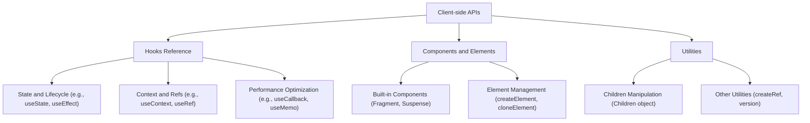

# Client-side APIs

React's client-side APIs and Hooks are essential for building interactive user interfaces that run directly in the browser. These tools enable you to manage component state, handle side effects, optimize performance, and structure your UI effectively.

This section provides an overview of the core React APIs available for client-side development. For detailed information on specific Hooks, components, or utilities, please refer to the dedicated sub-sections:

*   [Hooks Reference](./client-apis-hooks.md)
*   [Components and Elements](./client-apis-components-elements.md)
*   [Utilities](./client-apis-utilities.md)

## Overview of Client-side APIs

To better understand the organization of React's client-side capabilities, consider the following structure:

## Hooks

Hooks are functions that let you use React features like state and lifecycle methods directly in functional components. They allow for more reusable stateful logic without the need for class components. Key Hooks for client-side development include:

*   **useState**: Adds state variables to your functional components.
*   **useEffect**: Performs side effects in functional components, such as data fetching, subscriptions, or manually changing the DOM.
*   **useContext**: Subscribes to React context, allowing components to read context values from their ancestors.
*   **useRef**: Returns a mutable ref object, useful for accessing DOM nodes or React elements created in the render method, or for holding any mutable value that doesn’t cause a re-render when updated.
*   **useCallback**: Memoizes functions to prevent unnecessary re-renders of child components.
*   **useMemo**: Memoizes the result of a computation, recalculating only when its dependencies change.
*   **useReducer**: An alternative to `useState` for complex state logic that involves multiple sub-values or when the next state depends on the previous one.
*   **useImperativeHandle**: Customizes the instance value that is exposed to parent components when using `ref`.
*   **useLayoutEffect**: Similar to `useEffect`, but fires synchronously after all DOM mutations. Useful for reading layout from the DOM and synchronously re-rendering.
*   **useInsertionEffect**: Runs synchronously after DOM mutations but before layout effects. It's intended for CSS-in-JS libraries to inject styles.
*   **useDebugValue**: Displays a custom label for custom Hooks in React DevTools.
*   **useTransition**: Provides a way to mark state updates as non-urgent, allowing for a more responsive user interface.
*   **useDeferredValue**: Lets you defer updating a part of the UI, improving responsiveness by prioritizing more critical updates.
*   **useId**: Generates a stable and unique ID that can be used for accessibility attributes.
*   **useSyncExternalStore**: Subscribes to an external store, ensuring that changes to the store trigger re-renders in React.
*   **useCacheRefresh** (unstable): Allows refreshing a cached resource.
*   **useOptimistic**: Manages optimistic updates to the UI, showing a temporary state that will be reconciled with the actual state later.
*   **useActionState**: Provides a way to manage the state of a form action.
*   **experimental_useEffectEvent**: Defines an effect event that is not reactive, allowing specific values to be "read" without triggering a re-render.

For detailed information on each Hook, including usage examples and advanced scenarios, refer to the [Hooks Reference](./client-apis-hooks.md) section.

## Components and Elements

React provides several built-in components and utilities for creating and manipulating UI elements:

*   **Fragment**: Renders multiple elements without adding extra nodes to the DOM.
*   **Profiler**: Measures rendering performance of a React tree.
*   **PureComponent**: A class component that implements `shouldComponentUpdate` with a shallow prop and state comparison, potentially offering performance benefits.
*   **StrictMode**: A development tool for highlighting potential problems in an application.
*   **Suspense**: Lets you "wait" for some code to load and declaratively specify a loading state (like a spinner) while it's loading.
*   **createElement**: Creates and returns a new React element of the given type.
*   **cloneElement**: Clones and returns a new React element using element as the starting point.
*   **isValidElement**: Verifies if a value is a React element.
*   **createContext**: Creates a Context object.
*   **lazy**: Lets you defer loading of a component’s code until it’s rendered for the first time.
*   **forwardRef**: Lets your component expose a DOM node to a parent component with a ref.
*   **memo**: A higher-order component that memoizes the rendering of a functional component, re-rendering only when its props change.
*   **unstable_LegacyHidden**: Hides a tree without unmounting it.
*   **unstable_Activity**: Marks parts of the UI as interactive or not.
*   **unstable_Scope**: Provides a way to isolate parts of the UI.
*   **unstable_SuspenseList**: Renders multiple Suspense components and coordinates their loading order.
*   **unstable_TracingMarker**: A component for marking transitions for tracing purposes.
*   **unstable_ViewTransition**: Integrates with the browser's View Transition API for smooth UI transitions.

You can find in-depth documentation and examples for these in the [Components and Elements](./client-apis-components-elements.md) section.

## Utilities

Beyond Hooks and core components, React offers several utility functions for common tasks, such as manipulating children elements and accessing version information:

*   **Children**: An object containing utilities to work with `props.children`, including methods like `map`, `forEach`, `count`, `toArray`, and `only`.
*   **createRef**: Creates a ref object which can be attached to React elements via the `ref` attribute.
*   **version**: Provides the current version string of React.
*   **cache** (client-side): On the client, this currently acts as a no-op but is provided for API consistency with server environments.
*   **cacheSignal** (client-side): On the client, this currently returns `null` but is provided for API consistency.

For more details on these utilities, refer to the [Utilities](./client-apis-utilities.md) section.

---

This section has provided a high-level overview of the client-side APIs, Hooks, components, and utilities available in React. To delve deeper into specific functionalities, explore the linked sub-sections for detailed documentation and usage examples. You can start by learning more about managing state and effects with [Hooks Reference](./client-apis-hooks.md).