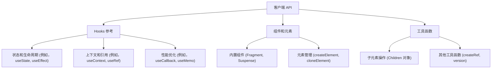

# 客户端 API

React 的客户端 API 和 Hooks 对于构建直接在浏览器中运行的交互式用户界面至关重要。这些工具使你能够管理组件状态、处理副作用、优化性能并有效地组织 UI。

本节概述了可用于客户端开发的核心 React API。有关特定 Hooks、组件或工具的详细信息，请参阅专门的子部分：

*   [Hooks 参考](./client-apis-hooks.md)
*   [组件和元素](./client-apis-components-elements.md)
*   [工具函数](./client-apis-utilities.md)

## 客户端 API 概述

为了更好地理解 React 客户端功能的组织结构，请考虑以下结构：

## Hooks

Hooks 是函数，它允许你直接在函数组件中使用 React 的特性，例如状态和生命周期方法。它们允许更可重用的有状态逻辑，而无需使用类组件。客户端开发的关键 Hooks 包括：

*   **useState**：为你的函数组件添加状态变量。
*   **useEffect**：在函数组件中执行副作用，例如数据获取、订阅或手动更改 DOM。
*   **useContext**：订阅 React 上下文，允许组件从其祖先读取上下文值。
*   **useRef**：返回一个可变的 ref 对象，用于访问 DOM 节点或渲染方法中创建的 React 元素，或用于保存任何可变值，且在更新时不会触发重新渲染。
*   **useCallback**：记忆化函数以防止子组件不必要的重新渲染。
*   **useMemo**：记忆化计算结果，仅在其依赖项更改时重新计算。
*   **useReducer**：`useState` 的替代方案，适用于涉及多个子值或下一个状态依赖于前一个状态的复杂状态逻辑。
*   **useImperativeHandle**：当使用 `ref` 时，自定义暴露给父组件的实例值。
*   **useLayoutEffect**：类似于 `useEffect`，但在所有 DOM 突变后同步触发。适用于从 DOM 读取布局并同步重新渲染。
*   **useInsertionEffect**：在 DOM 突变后但在布局效果之前同步运行。旨在供 CSS-in-JS 库注入样式。
*   **useDebugValue**：在 React DevTools 中为自定义 Hooks 显示自定义标签。
*   **useTransition**：提供一种将状态更新标记为非紧急的方式，从而实现更响应的用户界面。
*   **useDeferredValue**：允许你延迟更新 UI 的一部分，通过优先处理更关键的更新来提高响应性。
*   **useId**：生成一个稳定且唯一的 ID，可用于可访问性属性。
*   **useSyncExternalStore**：订阅外部存储，确保存储的更改触发 React 中的重新渲染。
*   **useCacheRefresh** (unstable)：允许刷新缓存资源。
*   **useOptimistic**：管理 UI 的乐观更新，显示一个临时状态，该状态稍后将与实际状态协调。
*   **useActionState**：提供一种管理表单 action 状态的方式。
*   **experimental_useEffectEvent**：定义一个非响应式 Effect 事件，允许“读取”特定值而不会触发重新渲染。

有关每个 Hook 的详细信息，包括使用示例和高级场景，请参阅 [Hooks 参考](./client-apis-hooks.md) 部分。

## 组件和元素

React 提供了几个内置组件和工具函数，用于创建和操作 UI 元素：

*   **Fragment**：渲染多个元素，而不在 DOM 中添加额外节点。
*   **Profiler**：测量 React 树的渲染性能。
*   **PureComponent**：一个类组件，通过浅层 props 和 state 比较实现 `shouldComponentUpdate`，可能提供性能优势。
*   **StrictMode**：一个开发工具，用于突出显示应用程序中潜在的问题。
*   **Suspense**：允许你“等待”某些代码加载，并在加载时声明性地指定加载状态（如加载指示器）。
*   **createElement**：创建并返回给定类型的新 React 元素。
*   **cloneElement**：克隆并返回一个以给定元素为起点的新 React 元素。
*   **isValidElement**：验证值是否为 React 元素。
*   **createContext**：创建一个 Context 对象。
*   **lazy**：允许你延迟加载组件的代码，直到它首次渲染。
*   **forwardRef**：允许你的组件通过 `ref` 将 DOM 节点暴露给父组件。
*   **memo**：一个高阶组件，记忆化函数组件的渲染，仅在其 props 更改时重新渲染。
*   **unstable_LegacyHidden**：隐藏一个树而不卸载它。
*   **unstable_Activity**：将 UI 的部分标记为交互式或非交互式。
*   **unstable_Scope**：提供一种隔离 UI 部分的方式。
*   **unstable_SuspenseList**：渲染多个 Suspense 组件并协调它们的加载顺序。
*   **unstable_TracingMarker**：用于标记跟踪目的的转换组件。
*   **unstable_ViewTransition**：与浏览器的 View Transition API 集成，实现平滑的 UI 过渡。

你可以在 [组件和元素](./client-apis-components-elements.md) 部分找到这些组件的深入文档和示例。

## 工具函数

除了 Hooks 和核心组件之外，React 还提供了几个用于常见任务的工具函数，例如操作子元素和访问版本信息：

*   **Children**：一个包含用于处理 `props.children` 的工具对象，包括 `map`、`forEach`、`count`、`toArray` 和 `only` 等方法。
*   **createRef**：创建一个 ref 对象，可以通过 `ref` 属性附加到 React 元素。
*   **version**：提供 React 的当前版本字符串。
*   **cache** (client-side)：在客户端，此功能目前是一个空操作，但为了与服务器环境的 API 一致性而提供。
*   **cacheSignal** (client-side)：在客户端，此功能目前返回 `null`，但为了 API 一致性而提供。

有关这些工具函数的更多详细信息，请参阅 [工具函数](./client-apis-utilities.md) 部分。

---

本节提供了 React 中可用的客户端 API、Hooks、组件和工具函数的高级概述。要深入了解特定功能，请探索链接的子部分以获取详细文档和使用示例。你可以从了解如何使用 [Hooks 参考](./client-apis-hooks.md) 管理状态和效果开始。