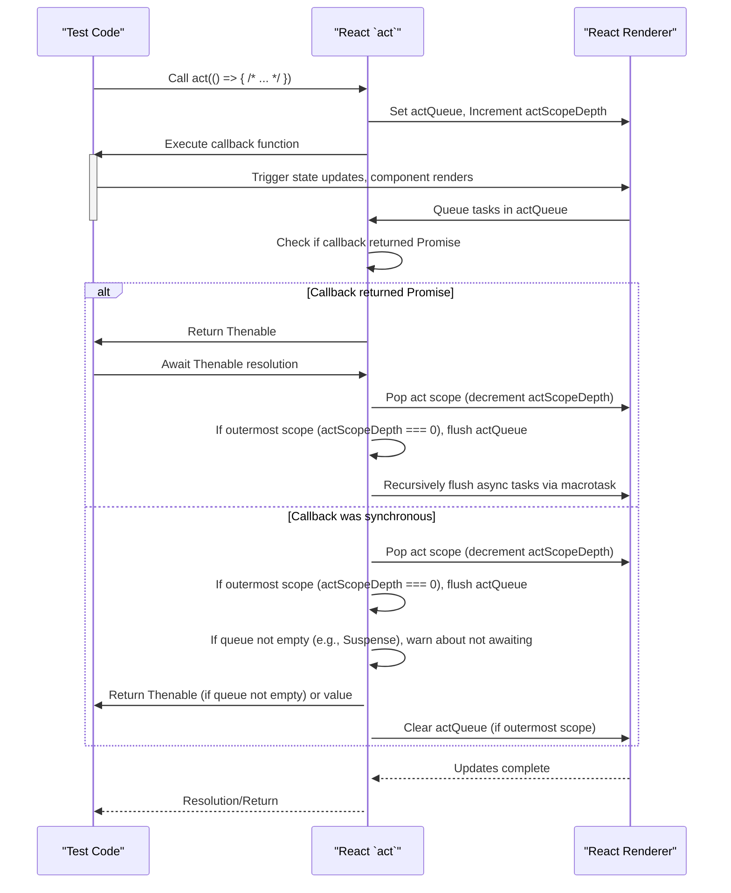

# Act for Testing

When testing React components, especially those that involve asynchronous updates, state changes, or side effects, the `act` utility is essential. `act` ensures that all React updates related to your test scenario are processed before assertions are made, making your tests predictable and reliable. Without `act`, your tests might run assertions before all updates have completed, leading to flaky results.

For broader context on handling non-urgent UI updates, refer to the [Transitions](./concurrency-features-transitions.md) section.

## How `act` Works

React's `act` function manages the execution of code that interacts with the React rendering environment. It ensures that all updates triggered within its scope are flushed and applied to the DOM before the `act` call completes. This is crucial for simulating browser behavior where updates are batched and processed asynchronously.

When `act` is called, it sets up an internal queue (`ReactSharedInternals.actQueue`) where React schedules its rendering and state updates. Instead of immediately executing these updates, React pushes them to this queue. Once the callback provided to `act` finishes, or if it returns a Promise and that Promise resolves, `act` processes this queue, ensuring all pending updates are completed.



### Internal State Management

`act` relies on several internal variables within `ReactSharedInternals` to manage its behavior, especially in development builds (`__DEV__`):

| Internal State | Description |
|---|---|
| `actScopeDepth` | Tracks the nesting level of `act` calls. Each `act` call increments it, and exiting a scope decrements it. |
| `actQueue` | An array (`Array<RendererTask>`) where React pushes all rendering and state update tasks when inside an `act` scope. |
| `isBatchingLegacy` | (Legacy mode only) Indicates if React is currently batching updates to replicate behavior of `batchedUpdates`. |
| `didScheduleLegacyUpdate` | (Legacy mode only) Tracks if an update was scheduled within the legacy batching scope. |
| `didUsePromise` | Tracks whether a component called `use` (e.g., for Suspense) during the current batch of work, affecting flushing logic. |
| `thrownErrors` | An array (`Array<mixed>`) to collect any uncaught errors that occur within the `act` scope, which are then aggregated and thrown at the end. |

## Using `act` in Tests

`act` can be used with both synchronous and asynchronous callbacks. The primary goal is to ensure all effects and updates are processed.

### Synchronous Updates

For synchronous operations that trigger React updates (e.g., clicking a button that changes state), wrap the interaction in `act`:

```javascript
import { act } from 'react';
import ReactDOM from 'react-dom'; // Assuming ReactDOM for rendering

function MyComponent() {
  const [count, setCount] = React.useState(0);
  return <button onClick={() => setCount(count + 1)}>{count}</button>;
}

// In your test file (example using a simplified test setup):
const container = document.createElement('div');
document.body.appendChild(container);

act(() => {
  ReactDOM.render(<MyComponent />, container);
});

const button = container.querySelector('button');
expect(button.textContent).toBe('0');

act(() => {
  button.dispatchEvent(new MouseEvent('click', { bubbles: true }));
});

// Now, all updates triggered by the click have been processed
expect(button.textContent).toBe('1');
```

### Asynchronous Updates

When your test involves asynchronous operations (e.g., data fetching, timers, `use` with Promises, or any code that returns a Promise), you must `await` the `act` call. This ensures that the Promise resolves and all subsequent React updates are processed.

```javascript
import { act } from 'react';
import ReactDOM from 'react-dom'; // Assuming ReactDOM for rendering

function fetchData() {
  return new Promise(resolve => setTimeout(() => resolve('Data loaded!'), 100));
}

function AsyncComponent() {
  const [data, setData] = React.useState(null);
  React.useEffect(() => {
    fetchData().then(result => setData(result));
  }, []);
  return <div>{data || 'Loading...'}</div>;
}

// In your test file (example using a simplified test setup):
const container = document.createElement('div');
document.body.appendChild(container);

act(() => {
  ReactDOM.render(<AsyncComponent />, container);
});

expect(container.textContent).toBe('Loading...');

// Await the act call when dealing with async operations
await act(async () => {
  // Simulate the passage of time for the setTimeout
  await new Promise(resolve => setTimeout(resolve, 100)); // Wait for fetchData to resolve
});

// Now, the async data fetch and subsequent updates should be complete
expect(container.textContent).toBe('Data loaded!');
```

### Warning: Not Awaiting Async `act`

If you call `act` with an `async` callback but do not `await` its result, React will issue a warning. This is because not awaiting an async `act` can lead to interleaved `act` scopes and unpredictable test behavior, as the updates from one `act` might mix with another.

For example, the following will trigger a warning:

```javascript
// This will cause a warning if not awaited
act(async () => {
  // ... async operations ...
});
```

The correct way is to `await` it:

```javascript
await act(async () => {
  // ... async operations ...
});
```

Similarly, if a component suspends within a synchronous `act` call but the `act` call itself is not awaited, React will warn you. This indicates that there are pending asynchronous tasks (like resolving the suspended component) that need to complete for the UI to stabilize.

### Overlapping `act` Calls

`act` calls cannot overlap. If you initiate an `act` scope and then try to start another one before the first has fully completed (e.g., by not awaiting an async `act`), React will issue an error:

`You seem to have overlapping act() calls, this is not supported. Be sure to await previous act() calls before making a new one.`

This ensures that each `act` scope completes its work in isolation, preventing race conditions and unpredictable test outcomes.

## `act` in Development Builds Only

The `act` function is exclusively available in development builds of React. Attempting to use `act` in a production build will result in an error:

`act(...) is not supported in production builds of React.`

This is because `act` provides specific testing utilities and debugging checks that are not necessary for production environments and would add unnecessary overhead.

## Conclusion

Using `act` correctly in your React tests is fundamental for creating robust and reliable test suites. It provides a controlled environment to ensure that all React-related updates are flushed and the component state is stable before you make assertions. By understanding its behavior with both synchronous and asynchronous operations, you can avoid common testing pitfalls and build more maintainable tests.

To further understand development-time utilities, proceed to the [Debugging Utilities](./development-optimization-debugging.md) section.