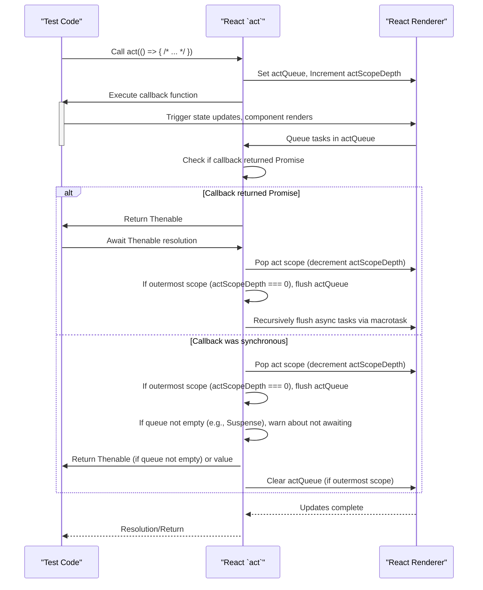

# 为测试而 Act

在测试 React 组件时，尤其是涉及异步更新、状态变化或副作用的组件，`act` 工具至关重要。`act` 确保在进行断言之前，所有与测试场景相关的 React 更新都已处理完毕，从而使您的测试具有可预测性和可靠性。如果没有 `act`，您的测试可能会在所有更新完成之前就运行断言，从而导致不稳定的结果。

有关处理非紧急 UI 更新的更广泛背景信息，请参阅[过渡](./concurrency-features-transitions.md)部分。

## `act` 的工作原理

React 的 `act` 函数管理与 React 渲染环境交互的代码执行。它确保在其作用域内触发的所有更新在 `act` 调用完成之前都被刷新并应用到 DOM。这对于模拟浏览器行为至关重要，因为在浏览器中更新是批量处理和异步进行的。

当调用 `act` 时，它会设置一个内部队列（`ReactSharedInternals.actQueue`），React 在其中调度其渲染和状态更新。React 不会立即执行这些更新，而是将它们推送到此队列。一旦提供给 `act` 的回调函数完成，或者如果它返回一个 Promise 并且该 Promise 得到解决，`act` 就会处理此队列，确保所有待处理的更新都已完成。



### 内部状态管理

`act` 依赖于 `ReactSharedInternals` 中的几个内部变量来管理其行为，尤其是在开发版本（`__DEV__`）中：

| Internal State | Description |
|---|---|
| `actScopeDepth` | 跟踪 `act` 调用的嵌套级别。每次 `act` 调用都会增加它，退出作用域时会减少它。 |
| `actQueue` | 一个数组（`Array<RendererTask>`），当处于 `act` 作用域内时，React 会将所有渲染和状态更新任务推送到此数组。 |
| `isBatchingLegacy` | （仅限旧版模式）指示 React 当前是否正在批量处理更新以复制 `batchedUpdates` 的行为。 |
| `didScheduleLegacyUpdate` | （仅限旧版模式）跟踪在旧版批量处理作用域内是否已调度更新。 |
| `didUsePromise` | 跟踪在当前批处理工作期间组件是否调用了 `use`（例如，用于 Suspense），这会影响刷新逻辑。 |
| `thrownErrors` | 一个数组（`Array<mixed>`），用于收集在 `act` 作用域内发生的任何未捕获错误，这些错误随后会被聚合并在最后抛出。 |

## 在测试中使用 `act`

`act` 可以与同步和异步回调函数一起使用。主要目标是确保所有效果和更新都得到处理。

### 同步更新

对于触发 React 更新的同步操作（例如，单击更改状态的按钮），将交互封装在 `act` 中：

```javascript
import { act } from 'react';
import ReactDOM from 'react-dom'; // 假设使用 ReactDOM 进行渲染

function MyComponent() {
  const [count, setCount] = React.useState(0);
  return <button onClick={() => setCount(count + 1)}>{count}</button>;
}

// 在您的测试文件中（使用简化测试设置的示例）：
const container = document.createElement('div');
document.body.appendChild(container);

act(() => {
  ReactDOM.render(<MyComponent />, container);
});

const button = container.querySelector('button');
expect(button.textContent).toBe('0');

act(() => {
  button.dispatchEvent(new MouseEvent('click', { bubbles: true }));
});

// 现在，所有由点击触发的更新都已处理完毕
expect(button.textContent).toBe('1');
```

### 异步更新

当您的测试涉及异步操作（例如，数据获取、计时器、带有 Promises 的 `use`，或任何返回 Promise 的代码）时，您必须 `await` `act` 调用。这确保 Promise 得到解决并且所有后续的 React 更新都已处理完毕。

```javascript
import { act } from 'react';
import ReactDOM from 'react-dom'; // 假设使用 ReactDOM 进行渲染

function fetchData() {
  return new Promise(resolve => setTimeout(() => resolve('Data loaded!'), 100));
}

function AsyncComponent() {
  const [data, setData] = React.useState(null);
  React.useEffect(() => {
    fetchData().then(result => setData(result));
  }, []);
  return <div>{data || 'Loading...'}</div>;
}

// 在您的测试文件中（使用简化测试设置的示例）：
const container = document.createElement('div');
document.body.appendChild(container);

act(() => {
  ReactDOM.render(<AsyncComponent />, container);
});

expect(container.textContent).toBe('Loading...');

// 处理异步操作时，await act 调用
await act(async () => {
  // 模拟 setTimeout 的时间流逝
  await new Promise(resolve => setTimeout(resolve, 100)); // 等待 fetchData 解决
});

// 现在，异步数据获取和后续更新应该都已完成
expect(container.textContent).toBe('Data loaded!');
```

### 警告：未 `await` 异步 `act`

如果您使用 `async` 回调调用 `act` 但未 `await` 其结果，React 将发出警告。这是因为未 `await` 异步 `act` 可能会导致 `act` 作用域交错和不可预测的测试行为，因为一个 `act` 的更新可能会与另一个 `act` 的更新混淆。

例如，以下代码将触发警告：

```javascript
// 如果不 await，这将导致警告
act(async () => {
  // ... 异步操作 ...
});
```

正确的方法是 `await` 它：

```javascript
await act(async () => {
  // ... 异步操作 ...
});
```

同样，如果组件在同步 `act` 调用中挂起但 `act` 调用本身未被 `await`，React 将警告您。这表示存在需要完成的待处理异步任务（例如解决挂起的组件）才能使 UI 稳定。

### `act` 调用重叠

`act` 调用不能重叠。如果您启动一个 `act` 作用域，然后在第一个作用域完全完成之前尝试启动另一个作用域（例如，通过不 `await` 异步 `act`），React 将发出错误：

`您似乎有重叠的 act() 调用，这是不支持的。在进行新的 act() 调用之前，请务必等待之前的 act() 调用完成。`

这确保每个 `act` 作用域独立完成其工作，防止竞态条件和不可预测的测试结果。

## 仅限开发版本中的 `act`

`act` 函数仅在 React 的开发版本中可用。尝试在生产版本中使用 `act` 将导致错误：

`在 React 的生产版本中不支持 act(...)。`

这是因为 `act` 提供了特定的测试工具和调试检查，这些在生产环境中是不必要的，并且会增加不必要的开销。

## 结论

在您的 React 测试中正确使用 `act` 对于创建健壮可靠的测试套件至关重要。它提供了一个受控环境，以确保所有与 React 相关的更新都被刷新并且组件状态在您进行断言之前是稳定的。通过理解其在同步和异步操作下的行为，您可以避免常见的测试陷阱并构建更易于维护的测试。

要进一步了解开发时期的工具，请前往[调试工具](./development-optimization-debugging.md)部分。