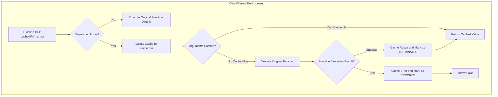
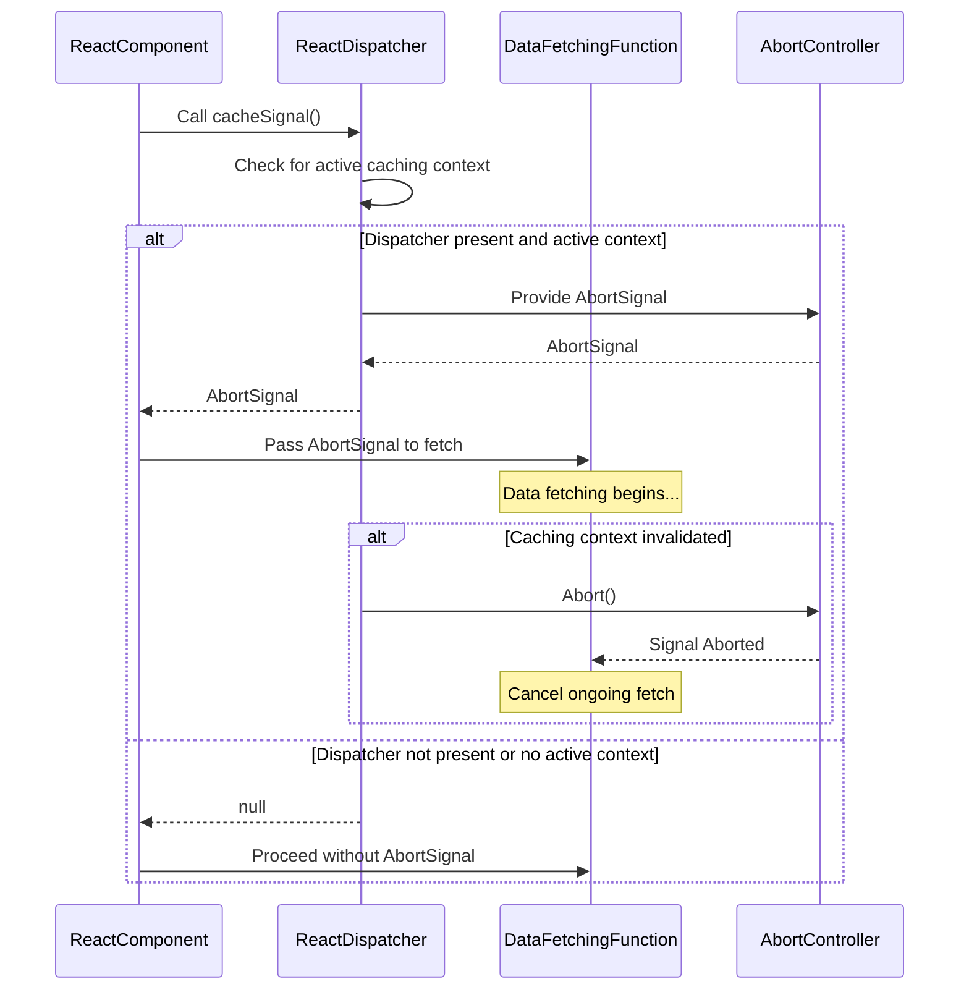

# Caching APIs

React offers `cache` and `cacheSignal` APIs to optimize data fetching and rendering. These APIs enable applications to store and reuse computation results, significantly enhancing performance and providing a smoother user experience, particularly in Server Components environments.

For a broader understanding of React's concurrency features, refer to the [Concurrency and Advanced Features](./concurrency-features.md) section.

## Understanding React's Internal Caching Mechanism

At its core, React's caching relies on a dispatcher, an internal mechanism that manages the execution context for hooks and other React functionalities. When `cache` is invoked within a React rendering environment, it leverages this dispatcher to access a dedicated cache for a given function.

The caching system maintains a tree-like structure using `WeakMap` for object and function arguments and `Map` for primitive arguments. Each node in this cache (`CacheNode`) tracks the status of a cached computation:
- **"UNTERMINATED" (0):** The computation has not yet completed or errored.
- **"TERMINATED" (1):** The computation successfully returned a value.
- **"ERRORED" (2):** The computation threw an error.

Here's a simplified flow of how the `cache` function determines whether to execute the original function or retrieve a cached result:



## `cache` API

The `cache` API provides a way to memoize the results of functions, preventing redundant computations. When you wrap a function with `cache`, React stores its return value based on its arguments. Subsequent calls with the same arguments will return the cached result instead of re-executing the original function.

```javascript
import {cache} from 'react'; // From 'react' package

function calculateExpensiveResult(a, b) {
  // Simulate an expensive computation
  console.log('Calculating expensive result...');
  return a * b;
}

const memoizedCalculate = cache(calculateExpensiveResult);

// First call: executes the original function
const result1 = memoizedCalculate(5, 10); // Output: Calculating expensive result..., 50
console.log(result1);

// Second call with same arguments: returns cached result
const result2 = memoizedCalculate(5, 10); // Output: 50 (no "Calculating..." log)
console.log(result2);

// Call with different arguments: executes original function again
const result3 = memoizedCalculate(2, 20); // Output: Calculating expensive result..., 40
console.log(result3);
```

**Parameters**

| Name | Type | Description |
|---|---|---|
| `fn` | `(...A) => T` | The function to be cached. This function should ideally be pure, meaning it produces the same output for the same inputs and has no side effects. |

**Returns**

| Name | Type | Description |
|---|---|---|
| `cachedFn` | `(...A) => T` | A memoized version of the input function `fn`. |

**Client-Side vs. Server-Side Behavior**

It is critical to understand that the `cache` API's behavior differs between client and server environments:

*   **Server Components Environment:** On the server, `cache` fully implements its memoization logic. This allows for powerful per-request caching, where computations can be reused across different parts of your React Server Components tree during a single request, significantly improving server-side rendering performance. The core implementation (`ReactCacheImpl.js`) is directly used.
*   **Client (Browser) Environment):** By default, on the client side, the `cache` API acts as a "no-op." This means it simply returns the original function without any caching behavior. The `ReactCacheClient.js` source explicitly states this, noting that client-side caching is intended for a future major release. Therefore, while you can use `cache` in shared components that run on both client and server, its caching benefits are currently limited to the server.

This distinction is important for applications that use Shared Components, as they need to be aware that the caching behavior will only apply when rendered on the server.

## `cacheSignal` API

The `cacheSignal` API provides an `AbortSignal` that can be used to cancel ongoing operations, particularly useful for data fetching within a cached context. If the caching context becomes invalid (e.g., due to navigation or a component unmounting), the signal will be aborted, allowing you to gracefully cancel pending requests or computations.

```javascript
import {cacheSignal} from 'react'; // From 'react' package

async function fetchDataWithSignal(url) {
  const signal = cacheSignal(); // Get the AbortSignal for the current cache context
  try {
    // Check if the signal is available and associate it with the fetch request
    const response = await fetch(url, signal ? {signal} : {});
    if (!response.ok) {
      throw new Error(`HTTP error! status: ${response.status}`);
    }
    const data = await response.json();
    console.log('Data fetched successfully:', data);
    return data;
  } catch (error) {
    if (error.name === 'AbortError') {
      console.log('Fetch aborted due to cache signal');
    } else {
      console.error('Error fetching data:', error);
    }
    throw error;
  }
}

// Example usage within a component or server function:
// fetchDataWithSignal('/api/data');
```

**Parameters**

The `cacheSignal` API takes no parameters.

**Returns**

| Name | Type | Description |
|---|---|---|
| `signal` | `null` &#124; `AbortSignal` | An `AbortSignal` if an active caching context is available; otherwise, `null`. |

**Client-Side vs. Server-Side Behavior**

Similar to `cache`, the `cacheSignal` API also behaves differently depending on the runtime environment:

*   **Server Components Environment:** On the server, `cacheSignal` returns an active `AbortSignal` tied to the lifecycle of the current server request or cached computation. This enables server-side data fetching functions to be aborted if their context is no longer needed.
*   **Client (Browser) Environment:** On the client side, `cacheSignal` currently returns `null`. This means that client-side data fetching operations using `cacheSignal` will not have an associated `AbortSignal` for cancellation. This behavior aligns with the `cache` API's current "no-op" status on the client.

Here's a sequence diagram illustrating the interaction of `cacheSignal`:



## Practical Applications and Considerations

The `cache` and `cacheSignal` APIs are designed for optimizing performance, primarily within the context of React Server Components and data fetching.
-   **`cache`** is ideal for memoizing the results of pure functions, especially those that perform expensive computations or data fetches. By preventing recalculations, it reduces server load and speeds up server-side rendering.
-   **`cacheSignal`** complements `cache` by providing a mechanism to manage the lifecycle of asynchronous operations tied to cached contexts. This is crucial for resource management and responsiveness, particularly in dynamic server environments where requests might be invalidated.

When developing shared components that run on both the client and the server, remember the current "no-op" behavior of `cache` and `cacheSignal` on the client. Design your components to gracefully handle scenarios where these APIs return a non-caching function or a `null` signal, ensuring your application remains functional across all environments.

---

This section provided a detailed overview of React's `cache` and `cacheSignal` APIs, highlighting their functionality, internal mechanisms, and crucial behavioral differences between client and server environments. Understanding these APIs is vital for building high-performance React applications, especially those leveraging Server Components.

To further explore advanced performance features, proceed to the [Postponing Rendering](./concurrency-features-postpone.md) section, which covers the `unstable_postpone` API for intentionally deferring UI updates.