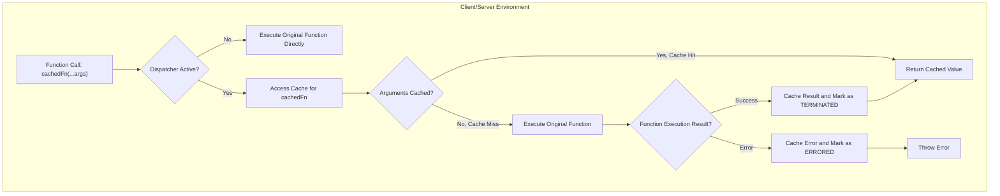
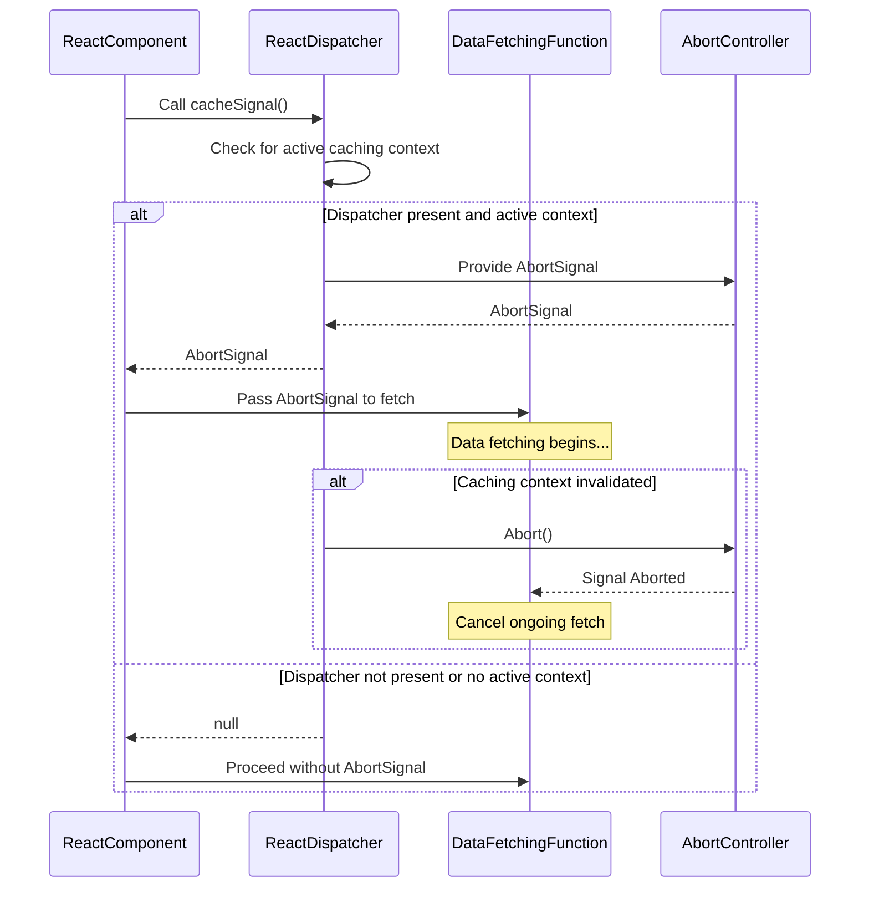

# 缓存 API

React 提供了 `cache` 和 `cacheSignal` API 来优化数据获取和渲染。这些 API 使应用程序能够存储和重用计算结果，显著提升性能并提供更流畅的用户体验，尤其是在 Server Components 环境中。

要更广泛地了解 React 的并发特性，请参阅 [并发和高级特性](./concurrency-features.md) 部分。

## 了解 React 的内部缓存机制

其核心是，React 的缓存依赖于一个调度器（dispatcher），这是一个管理 hooks 和其他 React 功能执行上下文的内部机制。当在 React 渲染环境中调用 `cache` 时，它会利用此调度器来访问给定函数的专用缓存。

缓存系统使用 `WeakMap` 存储对象和函数参数，使用 `Map` 存储原始类型参数，维护一个树状结构。此缓存中的每个节点 (`CacheNode`) 跟踪缓存计算的状态：
- **“未终止” (0)：** 计算尚未完成或出错。
- **“已终止” (1)：** 计算成功返回一个值。
- **“已出错” (2)：** 计算抛出了一个错误。

以下是 `cache` 函数如何确定是执行原始函数还是检索缓存结果的简化流程：



## `cache` API

`cache` API 提供了一种记忆化函数结果的方法，防止冗余计算。当您用 `cache` 包装一个函数时，React 会根据其参数存储其返回值。后续使用相同参数的调用将返回缓存结果，而不是重新执行原始函数。

```javascript
import {cache} from 'react'; // From 'react' package

function calculateExpensiveResult(a, b) {
  // Simulate an expensive computation
  console.log('Calculating expensive result...');
  return a * b;
}

const memoizedCalculate = cache(calculateExpensiveResult);

// First call: executes the original function
const result1 = memoizedCalculate(5, 10); // Output: Calculating expensive result..., 50
console.log(result1);

// Second call with same arguments: returns cached result
const result2 = memoizedCalculate(5, 10); // Output: 50 (no "Calculating..." log)
console.log(result2);

// Call with different arguments: executes original function again
const result3 = memoizedCalculate(2, 20); // Output: Calculating expensive result..., 40
console.log(result3);
```

**参数**

| 名称 | 类型 | 描述 |
|---|---|---|
| `fn` | `(...A) => T` | 要缓存的函数。此函数理想情况下应是纯函数，即对于相同的输入会产生相同的输出，且没有副作用。 |

**返回值**

| 名称 | 类型 | 描述 |
|---|---|---|
| `cachedFn` | `(...A) => T` | 输入函数 `fn` 的记忆化版本。 |

**客户端与服务器端行为差异**

理解 `cache` API 在客户端和服务器环境中的行为差异至关重要：

*   **Server Components 环境：** 在服务器上，`cache` 完全实现了其记忆化逻辑。这使得强大的每请求缓存成为可能，计算可以在单个请求中在 React Server Components 树的不同部分之间重用，从而显著提高服务器端渲染性能。核心实现 (`ReactCacheImpl.js`) 被直接使用。
*   **客户端（浏览器）环境：** 默认情况下，在客户端，`cache` API 表现为“空操作”（no-op）。这意味着它只是简单地返回原始函数，不执行任何缓存行为。`ReactCacheClient.js` 源代码明确指出了这一点，并指出客户端缓存旨在未来的主要版本中实现。因此，尽管您可以在同时在客户端和服务器上运行的共享组件中使用 `cache`，但其缓存优势目前仅限于服务器。

这种区别对于使用共享组件的应用程序很重要，因为它们需要意识到缓存行为仅在服务器上渲染时才适用。

## `cacheSignal` API

`cacheSignal` API 提供了一个 `AbortSignal`，可用于取消正在进行的操作，这对于在缓存上下文中获取数据特别有用。如果缓存上下文变得无效（例如，由于导航或组件卸载），信号将被中止，从而允许您优雅地取消挂起的请求或计算。

```javascript
import {cacheSignal} from 'react'; // From 'react' package

async function fetchDataWithSignal(url) {
  const signal = cacheSignal(); // Get the AbortSignal for the current cache context
  try {
    // Check if the signal is available and associate it with the fetch request
    const response = await fetch(url, signal ? {signal} : {});
    if (!response.ok) {
      throw new Error(`HTTP error! status: ${response.status}`);
    }
    const data = await response.json();
    console.log('Data fetched successfully:', data);
    return data;
  } catch (error) {
    if (error.name === 'AbortError') {
      console.log('Fetch aborted due to cache signal');
    } else {
      console.error('Error fetching data:', error);
    }
    throw error;
  }
}

// Example usage within a component or server function:
// fetchDataWithSignal('/api/data');
```

**参数**

`cacheSignal` API 不接受任何参数。

**返回值**

| 名称 | 类型 | 描述 |
|---|---|---|
| `signal` | `null` &#124; `AbortSignal` | 如果存在活动的缓存上下文，则为 `AbortSignal`；否则为 `null`。 |

**客户端与服务器端行为差异**

类似于 `cache`，`cacheSignal` API 的行为也因运行时环境而异：

*   **Server Components 环境：** 在服务器上，`cacheSignal` 返回一个活动的 `AbortSignal`，它与当前服务器请求或缓存计算的生命周期绑定。这使得服务器端数据获取函数可以在其上下文不再需要时被中止。
*   **客户端（浏览器）环境：** 在客户端，`cacheSignal` 目前返回 `null`。这意味着使用 `cacheSignal` 的客户端数据获取操作将不会有用于取消的关联 `AbortSignal`。此行为与 `cache` API 在客户端当前的“空操作”状态一致。

以下是 `cacheSignal` 交互的序列图：



## 实际应用与注意事项

`cache` 和 `cacheSignal` API 旨在优化性能，主要是在 React Server Components 和数据获取的上下文中。
-   **`cache`** 是记忆化纯函数结果的理想选择，特别是那些执行昂贵计算或数据获取的函数。通过防止重复计算，它减少了服务器负载并加速了服务器端渲染。
-   **`cacheSignal`** 通过提供一种机制来管理与缓存上下文相关的异步操作的生命周期，从而补充了 `cache`。这对于资源管理和响应能力至关重要，尤其是在请求可能失效的动态服务器环境中。

在开发同时在客户端和服务器上运行的共享组件时，请记住 `cache` 和 `cacheSignal` 在客户端当前的“空操作”行为。设计您的组件以优雅地处理这些 API 返回非缓存函数或 `null` 信号的场景，确保您的应用程序在所有环境中都能正常运行。

---

本节详细概述了 React 的 `cache` 和 `cacheSignal` API，重点介绍了它们的功能、内部机制以及客户端和服务器环境之间关键的行为差异。理解这些 API 对于构建高性能 React 应用程序至关重要，特别是那些利用 Server Components 的应用程序。

要进一步探索高级性能特性，请继续阅读 [延迟渲染](./concurrency-features-postpone.md) 部分，该部分介绍了用于有意推迟 UI 更新的 `unstable_postpone` API。