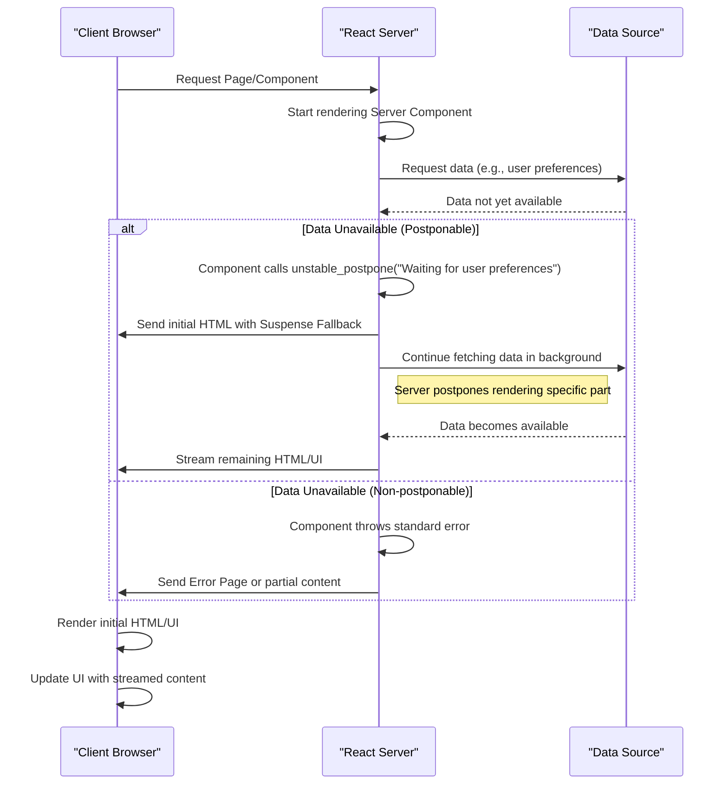

# Postponing Rendering

This section introduces `unstable_postpone`, an experimental API that allows developers to intentionally defer the rendering of parts of the user interface. This is particularly useful in server-side rendering (SSR) scenarios where certain data or resources are not immediately available, enabling a graceful fallback or streamed content experience.

For more details on managing non-urgent UI updates and advanced React capabilities, refer to [Concurrency and Advanced Features](./concurrency-features.md).

## How `unstable_postpone` Works

The `unstable_postpone` function is designed to pause rendering a component when necessary data or conditions are not met. Unlike throwing a standard JavaScript error, `unstable_postpone` throws a specialized `Postpone` instance. React recognizes this specific error type, identified by the `REACT_POSTPONE_TYPE` symbol, and handles it by deferring the rendering of the affected component without crashing the application.

This behavior is conceptually similar to how React's Suspense works for data fetching on the client side, where a fallback UI is shown until data is ready. On the server, `unstable_postpone` enables the server to stream initial HTML and then continue streaming the postponed content once the dependencies are resolved.

Here is a simplified flow of how `unstable_postpone` might interact in a server-side rendering context:



## Usage

The `unstable_postpone` API takes a single argument: a string `reason`. This `reason` string describes why the rendering is being postponed, which can be valuable for debugging and understanding the deferral flow.

**Parameters**

| Name   | Type   | Description                                                     |
|--------|--------|-----------------------------------------------------------------|
| `reason` | `string` | A descriptive message indicating why rendering is being postponed. |

**Example**

```javascript
import { unstable_postpone } from 'react';

async function MyServerComponent() {
  const data = await fetchData(); // Imagine this takes time or is not ready

  if (!data) {
    unstable_postpone("Data for MyServerComponent is not ready yet.");
  }

  return (
    <div>
      {/* Render content using data */}
      <h1>{data.title}</h1>
      <p>{data.description}</p>
    </div>
  );
}

// In a server environment (e.g., Next.js, Remix, or a custom SSR setup)
// MyServerComponent would be rendered as part of the page.
```

This example illustrates a scenario where `MyServerComponent` attempts to fetch data. If the data is not immediately available, it calls `unstable_postpone`, signaling React to defer the rendering of this component. On the server, this might result in an initial HTML response being sent with a placeholder, and the full component content streamed later once the data is resolved.

## Considerations

*   **Experimental Status**: The `unstable_` prefix indicates that `unstable_postpone` is an experimental API. It is subject to breaking changes or removal in future React releases. Use it with caution in production environments.
*   **Primary Use Case**: This API is primarily intended for use in React Server Components or during server-side rendering (SSR) streaming. It allows for more granular control over when parts of your UI are sent to the client, improving perceived performance by avoiding long initial load times for data-dependent sections.
*   **Contrast with Suspense**: While `unstable_postpone` and Suspense both handle asynchronous operations by showing fallbacks, `unstable_postpone` is specifically for server-side deferral, often when the server has incomplete data to send. Suspense handles client-side loading states for data fetching, code splitting, and other asynchronous operations.

---

Understanding `unstable_postpone` enables more control over streaming and loading states in server-rendered applications. Continue exploring more advanced React features in [Transitions](./concurrency-features-transitions.md) to manage non-urgent UI updates, or learn about [Caching APIs](./concurrency-features-caching.md) for performance optimization.