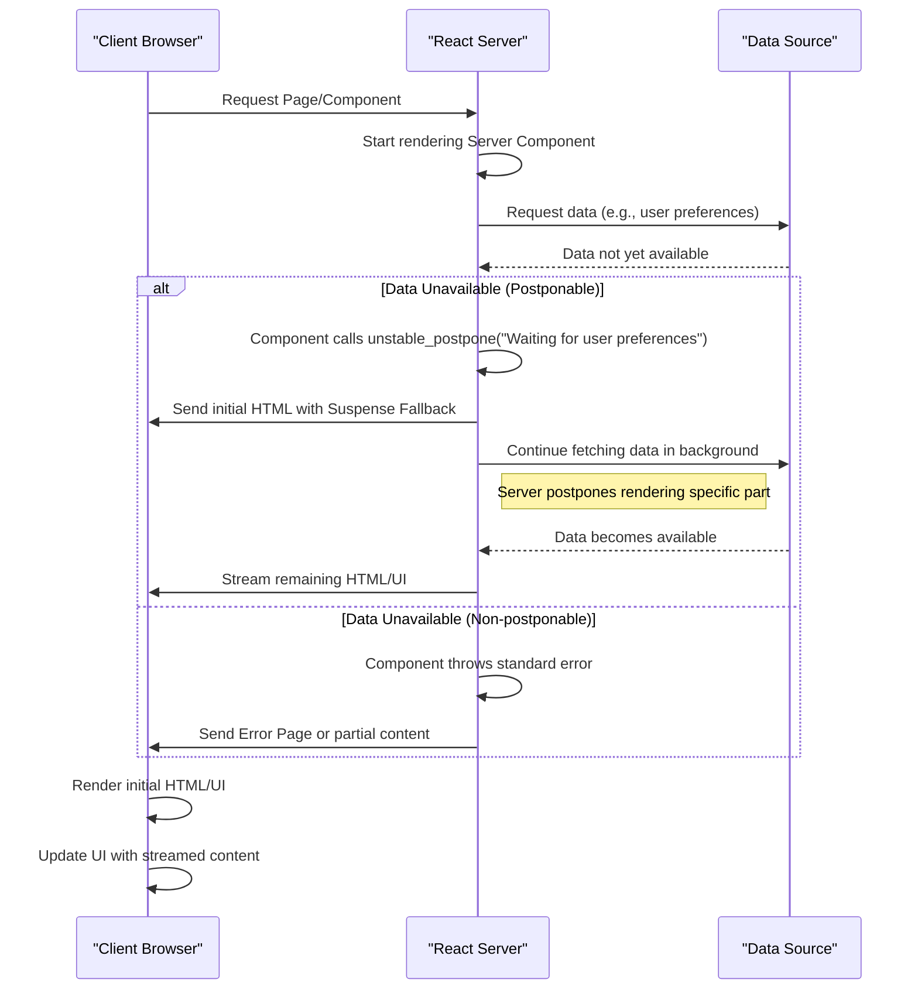

# 推迟渲染

本节介绍 `unstable_postpone`，这是一个实验性 API，允许开发者有意地推迟用户界面部分内容的渲染。这在服务器端渲染 (SSR) 场景中特别有用，当某些数据或资源无法立即获取时，它能够实现优雅的降级或流式内容体验。

有关管理非紧急 UI 更新和高级 React 功能的更多详细信息，请参阅 [并发和高级功能](./concurrency-features.md)。

## `unstable_postpone` 的工作原理

`unstable_postpone` 函数旨在当所需数据或条件未满足时暂停组件的渲染。与抛出标准 JavaScript 错误不同，`unstable_postpone` 抛出一个专门的 `Postpone` 实例。React 识别此特定错误类型（由 `REACT_POSTPONE_TYPE` 符号标识），并通过推迟受影响组件的渲染来处理它，而不会导致应用程序崩溃。

这种行为在概念上类似于 React 的 Suspense 在客户端进行数据获取的工作方式，即在数据准备好之前显示一个备用 UI。在服务器端，`unstable_postpone` 允许服务器流式传输初始 HTML，然后在依赖项解析后继续流式传输推迟的内容。

以下是 `unstable_postpone` 在服务器端渲染环境中可能如何交互的简化流程：



## 用法

`unstable_postpone` API 接受一个单独的参数：一个字符串 `reason`。这个 `reason` 字符串描述了为什么渲染被推迟，这对于调试和理解推迟流程非常有价值。

**参数**

| Name   | Type   | Description                                                     |
|--------|--------|-----------------------------------------------------------------|
| `reason` | `string` | 描述为什么渲染被推迟的消息。 |

**示例**

```javascript
import { unstable_postpone } from 'react';

async function MyServerComponent() {
  const data = await fetchData(); // Imagine this takes time or is not ready

  if (!data) {
    unstable_postpone("Data for MyServerComponent is not ready yet.");
  }

  return (
    <div>
      {/* Render content using data */}
      <h1>{data.title}</h1>
      <p>{data.description}</p>
    </div>
  );
}

// In a server environment (e.g., Next.js, Remix, or a custom SSR setup)
// MyServerComponent would be rendered as part of the page.
```

此示例说明了一个场景，其中 `MyServerComponent` 尝试获取数据。如果数据未立即获取到，它会调用 `unstable_postpone`，通知 React 推迟此组件的渲染。在服务器端，这可能导致发送带有占位符的初始 HTML 响应，并在数据解析后稍后流式传输完整的组件内容。

## 注意事项

*   **实验性状态**：`unstable_` 前缀表示 `unstable_postpone` 是一个实验性 API。它在未来的 React 版本中可能会有破坏性更改或被移除。请在生产环境中谨慎使用。
*   **主要用例**：此 API 主要用于 React 服务器组件或服务器端渲染 (SSR) 流式传输期间。它允许更精细地控制 UI 的哪些部分发送到客户端，通过避免数据依赖部分长时间的初始加载来提高感知性能。
*   **与 Suspense 的对比**：虽然 `unstable_postpone` 和 Suspense 都通过显示回退来处理异步操作，但 `unstable_postpone` 专门用于服务器端推迟，通常在服务器数据不完整时发送。Suspense 处理客户端数据获取、代码拆分和其他异步操作的加载状态。

---

理解 `unstable_postpone` 可以在服务器渲染应用程序中更好地控制流式传输和加载状态。继续探索 [Transitions](./concurrency-features-transitions.md) 中的更多高级 React 功能来管理非紧急 UI 更新，或了解 [Caching APIs](./concurrency-features-caching.md) 以进行性能优化。