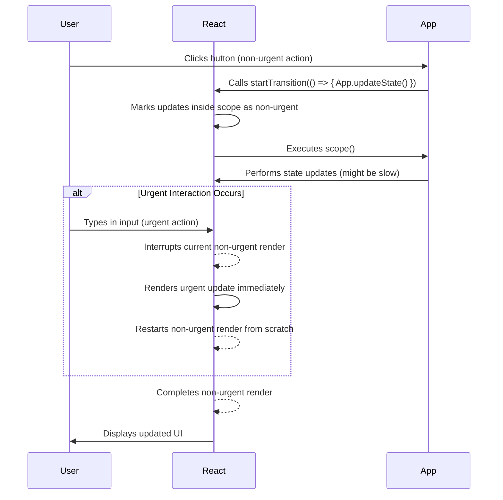
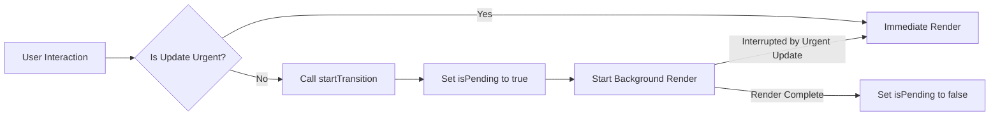

# Transitions

React's Transitions feature allows you to mark certain UI updates as non-urgent. This is a crucial mechanism for maintaining application responsiveness, especially during large state changes or data fetching operations. By differentiating between urgent updates (like typing into an input) and non-urgent ones (like fetching search results), React can keep the user interface interactive and fluid. This section details the `startTransition` API and the `useTransition` Hook, along with other related experimental APIs.

For a broader understanding of how React handles UI updates and prioritization, refer to the [Concurrency and Advanced Features](./concurrency-features.md) overview.

## `startTransition` API

The `startTransition` API allows you to explicitly mark a block of code containing state updates as a "transition." Updates within a transition are treated as non-urgent, meaning React can interrupt them if more urgent updates (like user input) occur. This helps prevent the UI from freezing and improves the overall user experience.

### Usage

```javascript
import { startTransition } from 'react';

function updateProfile() {
  startTransition(() => {
    // Non-urgent state updates go here
    setProfileData(fetchNewData());
    setNotifications('Loading new data...');
  });
}
```

### Parameters

| Name | Type | Description |
|---|---|---|
| `scope` | `() => void` | A function containing the state updates that should be treated as non-urgent. This function can return a Promise, in which case the transition will remain pending until the Promise resolves or rejects. |
| `options` | `object` | An optional object that provides additional configuration for the transition. |
| `options.name` | `string` | An optional name for the transition. This is primarily used for debugging and tracing purposes when `enableTransitionTracing` is enabled. |

### Behavior

*   **Interruptible Updates**: If an urgent update (e.g., a keyboard press) comes in while a transition is in progress, React will interrupt the transition, render the urgent update, and then restart the transition from scratch.
*   **Concurrent Rendering**: `startTransition` leverages React's concurrent renderer, allowing it to prepare the new UI in the background without blocking the main thread.
*   **Error Handling**: If the `scope` function throws an error, it is reported globally, and the current transition is released.
*   **Nesting**: When `startTransition` calls are nested, inner transitions typically inherit the `types` set from their parent transition, ensuring they are conceptually joined into the same entangled transition. This is relevant when `enableViewTransition` is active.
*   **Development Warnings**: In development mode, React warns if a large number of `_updatedFibers` (more than 10) are detected inside a transition. This often indicates a subscription that should be rewritten using React-provided hooks.

### Transition Flow



## `useTransition` Hook

The `useTransition` Hook provides a convenient way to integrate transitions into your functional components. It returns a boolean `isPending` to indicate if a transition is active and a `startTransition` function (similar to the standalone API) to mark state updates as non-urgent.

### Usage

```javascript
import { useState, useTransition } from 'react';

function SearchInput() {
  const [query, setQuery] = useState('');
  const [isPending, startTransition] = useTransition();

  function handleChange(e) {
    // Urgent update: immediately update the input value
    setQuery(e.target.value);

    // Non-urgent update: start a transition for search results
    startTransition(() => {
      // Perform search or update search results state here
      console.log('Searching for:', e.target.value);
      // setSearchResults(fetchSearchResults(e.target.value));
    });
  }

  return (
    <div>
      <input value={query} onChange={handleChange} />
      {isPending && <span>Loading search results...</span>}
    </div>
  );
}
```

### Return Value

`useTransition` returns an array with two elements:

| Name | Type | Description |
|---|---|---|
| `isPending` | `boolean` | A boolean indicating whether a transition is currently pending. `true` if a transition is in progress, `false` otherwise. |
| `startTransition` | `(callback: () => void, options?: StartTransitionOptions) => void` | A function identical to the `startTransition` API. Call this function with a callback that contains your non-urgent state updates. |

### Use Cases

*   **Keeping UI Responsive**: When a user types into a search input, the input itself needs to update immediately (urgent). However, fetching and rendering search results can be deferred into a transition, preventing the input from feeling sluggish.
*   **Visual Feedback**: The `isPending` flag allows you to show loading indicators (e.g., spinners, skeleton screens) specifically for the non-urgent part of your UI, providing better user feedback.

### `isPending` Flow



## `unstable_addTransitionType` API

This experimental API allows you to associate a specific type with the currently active transition. This is primarily used in conjunction with experimental features like View Transitions, where you might want to categorize or identify a transition.

### Usage

```javascript
import { unstable_addTransitionType } from 'react';

function handleNavigation() {
  startTransition(() => {
    unstable_addTransitionType('page-navigation');
    // Perform navigation-related state updates
  });
}
```

### Parameters

| Name | Type | Description |
|---|---|---|
| `type` | `string` | A string representing the type to associate with the current transition. If no transition is active, it implicitly starts one around the `addTransitionType` call (though this behavior might trigger development warnings). |

### Cautions

*   This API is part of an experimental feature (`enableViewTransition`) and may change. It should be used with caution.
*   Calling `unstable_addTransitionType` outside of a `startTransition` or `startGestureTransition` callback is generally discouraged and will trigger a console error in development, as it must be associated with a specific transition.

## `unstable_startGestureTransition` API

`unstable_startGestureTransition` is an experimental API designed for integrating with gesture-driven transitions, often used in scenarios like shared element transitions or interactive animations. It explicitly links a transition to a `GestureProvider`, allowing for more fine-grained control over the transition's lifecycle tied to user gestures.

### Usage

```javascript
import { unstable_startGestureTransition } from 'react';

// Assume 'gestureTimeline' is a GestureProvider instance
function startInteractiveTransition(gestureTimeline) {
  unstable_startGestureTransition(gestureTimeline, () => {
    // State updates that are part of the gesture-driven transition
    console.log('Starting gesture-driven update');
  }, { name: 'interactive-swipe' });
}
```

### Parameters

| Name | Type | Description |
|---|---|---|
| `provider` | `GestureProvider` | A required `GestureProvider` instance that controls the timeline and progress of the gesture. Cannot be `null`. |
| `scope` | `() => void` | A synchronous function containing the state updates for the gesture-driven transition. This function *must not* return a Promise (i.e., it cannot be `async`). |
| `options` | `object` | An optional object that includes `GestureOptions` and `StartTransitionOptions` (e.g., `name` for tracing). |

### Cautions

*   This API is highly experimental and is only available when the `enableGestureTransition` flag is enabled.
*   The `scope` function passed to `unstable_startGestureTransition` must be synchronous. Using an `async` function will result in a console error in development mode, as gesture transitions are expected to start immediately.
*   This API requires a valid `GestureProvider` instance; passing `null` will result in an error.

--- 

Transitions are a powerful tool for building highly responsive and fluid React applications. By effectively using `startTransition` and `useTransition`, you can ensure that your UI remains interactive even during complex updates.

To learn more about optimizing application performance beyond transitions, proceed to the [Caching APIs](./concurrency-features-caching.md) section.