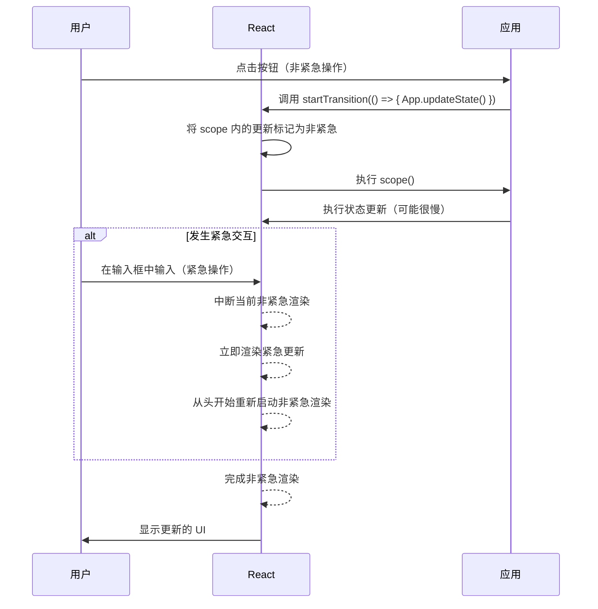
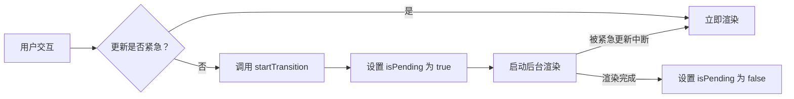

# 过渡

React 的过渡特性允许你将某些 UI 更新标记为非紧急的。这是维持应用程序响应能力的关键机制，尤其是在大型状态变化或数据获取操作期间。通过区分紧急更新（如在输入框中打字）和非紧急更新（如获取搜索结果），React 可以保持用户界面交互性和流畅性。本节详细介绍了 `startTransition` API 和 `useTransition` Hook，以及其他相关的实验性 API。

要更全面地了解 React 如何处理 UI 更新和优先级，请参阅[并发和高级特性](./concurrency-features.md)概述。

## `startTransition` API

`startTransition` API 允许你将包含状态更新的代码块显式标记为“过渡”。过渡内的更新被视为非紧急的，这意味着如果发生更紧急的更新（如用户输入），React 可以中断它们。这有助于防止 UI 冻结并改善整体用户体验。

### 用法

```javascript
import { startTransition } from 'react';

function updateProfile() {
  startTransition(() => {
    // 非紧急状态更新在此处进行
    setProfileData(fetchNewData());
    setNotifications('正在加载新数据...');
  });
}
```

### 参数

| Name | Type | Description |
|---|---|---|
| `scope` | `() => void` | 一个包含应被视为非紧急状态更新的函数。此函数可以返回一个 Promise，在这种情况下，过渡将保持挂起状态，直到 Promise 解决或拒绝。 |
| `options` | `object` | 一个可选对象，为过渡提供额外的配置。 |
| `options.name` | `string` | 过渡的可选名称。这主要在启用 `enableTransitionTracing` 时用于调试和追踪目的。 |

### 行为

*   **可中断更新**：如果在过渡进行中时，有紧急更新（例如，键盘按下）传入，React 将中断过渡，渲染紧急更新，然后从头开始重新启动过渡。
*   **并发渲染**：`startTransition` 利用 React 的并发渲染器，允许它在后台准备新的 UI，而不会阻塞主线程。
*   **错误处理**：如果 `scope` 函数抛出错误，该错误将在全局范围内报告，并且当前过渡将被释放。
*   **嵌套**：当 `startTransition` 调用嵌套时，内部过渡通常会继承其父过渡设置的 `types`，确保它们在概念上连接到同一个纠缠的过渡中。这在 `enableViewTransition` 激活时是相关的。
*   **开发警告**：在开发模式下，如果在过渡中检测到大量 `_updatedFibers`（超过 10 个），React 会发出警告。这通常表示应该使用 React 提供的 Hook 重写订阅。

### 过渡流程



## `useTransition` Hook

`useTransition` Hook 提供了一种方便的方式将过渡集成到你的函数组件中。它返回一个布尔值 `isPending` 来指示过渡是否处于活动状态，以及一个 `startTransition` 函数（类似于独立的 API）来将状态更新标记为非紧急。

### 用法

```javascript
import { useState, useTransition } from 'react';

function SearchInput() {
  const [query, setQuery] = useState('');
  const [isPending, startTransition] = useTransition();

  function handleChange(e) {
    // 紧急更新：立即更新输入值
    setQuery(e.target.value);

    // 非紧急更新：为搜索结果启动过渡
    startTransition(() => {
      // 在此处执行搜索或更新搜索结果状态
      console.log('正在搜索：', e.target.value);
      // setSearchResults(fetchSearchResults(e.target.value));
    });
  }

  return (
    <div>
      <input value={query} onChange={handleChange} />
      {isPending && <span>正在加载搜索结果...</span>}
    </div>
  );
}
```

### 返回值

`useTransition` 返回一个包含两个元素的数组：

| Name | Type | Description |
|---|---|---|
| `isPending` | `boolean` | 一个布尔值，指示过渡是否当前处于挂起状态。如果过渡正在进行，则为 `true`，否则为 `false`。 |
| `startTransition` | `(callback: () => void, options?: StartTransitionOptions) => void` | 一个与 `startTransition` API 相同的函数。使用包含非紧急状态更新的回调函数调用此函数。 |

### 用例

*   **保持 UI 响应**：当用户在搜索输入框中打字时，输入框本身需要立即更新（紧急）。但是，获取和渲染搜索结果可以推迟到过渡中，从而防止输入框感觉迟钝。
*   **视觉反馈**：`isPending` 标志允许你专门为 UI 的非紧急部分显示加载指示器（例如，加载旋转图标、骨架屏），从而提供更好的用户反馈。

### `isPending` 流程



## `unstable_addTransitionType` API

这个实验性 API 允许你将特定类型与当前活动的过渡关联起来。这主要与像视图过渡这样的实验性特性结合使用，在这种情况下，你可能希望对过渡进行分类或标识。

### 用法

```javascript
import { unstable_addTransitionType } from 'react';

function handleNavigation() {
  startTransition(() => {
    unstable_addTransitionType('page-navigation');
    // 执行导航相关的状态更新
  });
}
```

### 参数

| Name | Type | Description |
|---|---|---|
| `type` | `string` | 一个字符串，表示要与当前过渡关联的类型。如果没有活动的过渡，它会隐式地在 `addTransitionType` 调用周围启动一个过渡（尽管此行为可能会触发开发警告）。 |

### 注意事项

*   此 API 是实验性特性 (`enableViewTransition`) 的一部分，并且可能会更改。应谨慎使用。
*   通常不建议在 `startTransition` 或 `startGestureTransition` 回调之外调用 `unstable_addTransitionType`，因为它必须与特定过渡关联，否则会在开发模式下触发控制台错误。

## `unstable_startGestureTransition` API

`unstable_startGestureTransition` 是一个实验性 API，旨在与手势驱动的过渡集成，常用于共享元素过渡或交互式动画等场景。它明确地将过渡链接到一个 `GestureProvider`，从而允许更细粒度地控制与用户手势相关的过渡生命周期。

### 用法

```javascript
import { unstable_startGestureTransition } from 'react';

// 假设 'gestureTimeline' 是一个 GestureProvider 实例
function startInteractiveTransition(gestureTimeline) {
  unstable_startGestureTransition(gestureTimeline, () => {
    // 作为手势驱动过渡一部分的状态更新
    console.log('正在启动手势驱动更新');
  }, { name: 'interactive-swipe' });
}
```

### 参数

| Name | Type | Description |
|---|---|---|
| `provider` | `GestureProvider` | 一个必需的 `GestureProvider` 实例，它控制手势的时间线和进度。不能为 `null`。 |
| `scope` | `() => void` | 一个同步函数，包含手势驱动过渡的状态更新。此函数*不得*返回 Promise（即，它不能是 `async`）。 |
| `options` | `object` | 一个可选对象，包含 `GestureOptions` 和 `StartTransitionOptions`（例如，用于追踪的 `name`）。 |

### 注意事项

*   此 API 具有高度实验性，仅在启用 `enableGestureTransition` 标志时可用。
*   传递给 `unstable_startGestureTransition` 的 `scope` 函数必须是同步的。使用 `async` 函数将在开发模式下导致控制台错误，因为手势过渡预计会立即开始。
*   此 API 需要一个有效的 `GestureProvider` 实例；传递 `null` 将导致错误。

---

过渡是构建高度响应和流畅的 React 应用程序的强大工具。通过有效使用 `startTransition` 和 `useTransition`，你可以确保你的 UI 即使在复杂更新期间也能保持交互性。

要了解有关过渡之外的应用程序性能优化的更多信息，请继续阅读[缓存 API](./concurrency-features-caching.md) 部分。