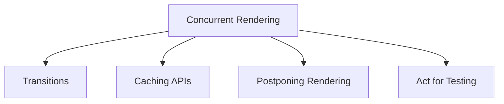

# Concurrency and Advanced Features

React's advanced capabilities, particularly concurrent rendering, are designed to enhance the responsiveness and perceived performance of your applications. This section explores key features like transitions, caching, and mechanisms for pausing or postponing UI updates, which collectively contribute to a smoother user experience.

At the core, concurrent rendering allows React to work on multiple tasks simultaneously and prioritize updates, ensuring that urgent user interactions (like typing) feel immediate, while less urgent updates (like fetching data) can be gracefully deferred without blocking the UI. This is a significant shift from the traditional blocking rendering model.

## Transitions

Transitions in React allow you to differentiate between urgent and non-urgent updates, enabling the UI to remain responsive during potentially long-running state changes. The `startTransition` API and `useTransition` Hook facilitate this by marking updates that can be interrupted and displayed later. Additionally, experimental APIs like `unstable_addTransitionType` and `unstable_startGestureTransition` provide finer control over transition types and gesture-driven updates. Learn more in the [Transitions](./concurrency-features-transitions.md) documentation.

## Caching APIs

To optimize data fetching and rendering performance, React provides caching APIs such as `cache` and `cacheSignal`. The `cache` function allows you to memoize the results of computations, while `cacheSignal` provides an `AbortSignal` for managing cached data. The `unstable_getCacheForType` hook is also available for more advanced caching scenarios. Explore how to leverage these features for better application performance in the [Caching APIs](./concurrency-features-caching.md) section.

## Postponing Rendering

The `unstable_postpone` API offers a mechanism to intentionally defer the rendering of certain parts of your UI, especially useful in server-side rendering contexts. This allows you to prioritize the delivery of critical content while postponing less essential parts, improving initial load times and perceived performance. Detailed usage and considerations are covered in the [Postponing Rendering](./concurrency-features-postpone.md) documentation.

## Act for Testing

When testing React components, especially those involving asynchronous updates or side effects, the `act` utility ensures that all updates related to a "unit" of interaction are processed and applied before assertions are made. This leads to more predictable and reliable test results. Understand how to use `act` effectively in your test suite by visiting the [Act for Testing](./concurrency-features-act-testing.md) guide.

---

Understanding and utilizing these concurrency and advanced features will help you build more performant, responsive, and user-friendly React applications. We recommend exploring each of the linked sections for in-depth guidance on these powerful capabilities.