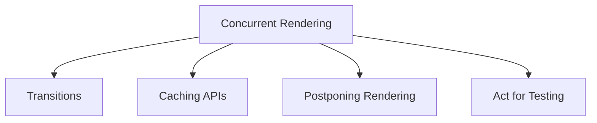

# 并发和高级特性

React 的高级能力，尤其是并发渲染，旨在增强您应用程序的响应性和感知性能。本节探讨了过渡、缓存以及暂停或推迟 UI 更新等关键特性，这些特性共同有助于提供更流畅的用户体验。

核心在于，并发渲染允许 React 同时处理多个任务并优先处理更新，确保紧急的用户交互（如打字）能够即时响应，而不那么紧急的更新（如数据获取）则可以优雅地推迟，而不会阻塞 UI。这与传统的阻塞渲染模型有着显著不同。

## 过渡

React 中的过渡允许您区分紧急更新和非紧急更新，使 UI 在潜在的长时间运行状态变更期间保持响应。`startTransition` API 和 `useTransition` Hook 通过标记可以中断并稍后显示的更新来促进这一点。此外，像 `unstable_addTransitionType` 和 `unstable_startGestureTransition` 这样的实验性 API 提供了对过渡类型和手势驱动更新的更精细控制。在 [过渡](./concurrency-features-transitions.md) 文档中了解更多。

## 缓存 API

为了优化数据获取和渲染性能，React 提供了 `cache` 和 `cacheSignal` 等缓存 API。`cache` 函数允许您记忆计算结果，而 `cacheSignal` 则为管理缓存数据提供了 `AbortSignal`。`unstable_getCacheForType` hook 也可用于更高级的缓存场景。在 [缓存 API](./concurrency-features-caching.md) 部分了解如何利用这些特性来提升应用程序性能。

## 推迟渲染

`unstable_postpone` API 提供了一种机制，可以有意推迟渲染 UI 的某些部分，这在服务器端渲染环境中尤其有用。这使您能够优先交付关键内容，同时推迟不那么重要的部分，从而改善初始加载时间和感知性能。在 [推迟渲染](./concurrency-features-postpone.md) 文档中详细介绍了用法和注意事项。

## 用于测试的 Act

在测试 React 组件时，尤其是那些涉及异步更新或副作用的组件时，`act` 工具确保在进行断言之前，与交互“单元”相关的所有更新都已处理和应用。这会带来更可预测和可靠的测试结果。通过访问 [用于测试的 Act](./concurrency-features-act-testing.md) 指南，了解如何在测试套件中有效使用 `act`。

---

理解并利用这些并发和高级特性将帮助您构建更具性能、响应性和用户友好的 React 应用程序。我们建议您探索每个链接的部分，以获取关于这些强大功能的深入指导。