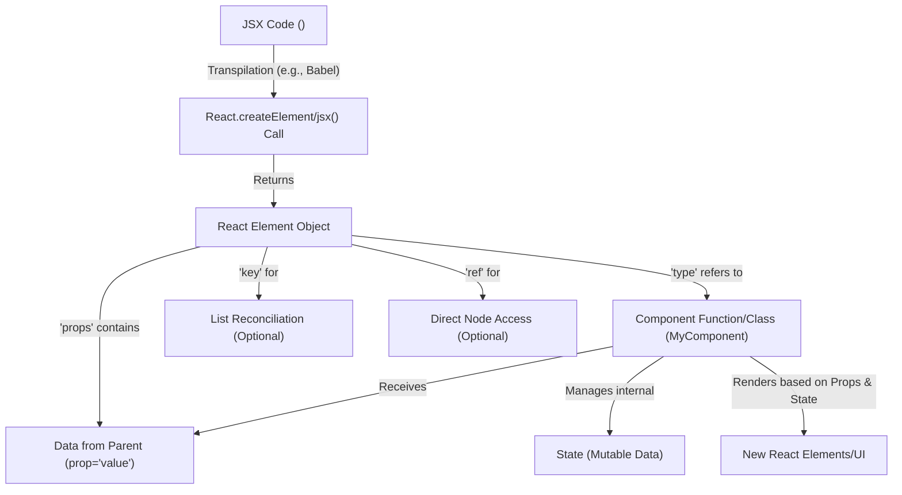

# Core Concepts

To effectively build user interfaces with React, it is essential to understand its fundamental concepts. This section introduces the core building blocks of React applications, including components, the JSX syntax, the role of React Elements, and how data flows through your application via props and state. These concepts are crucial for creating structured, dynamic, and maintainable UIs.

For a detailed reference on specific React APIs and Hooks, refer to the [Client-side APIs](./client-apis.md) and [Hooks Reference](./client-apis-hooks.md) sections.

## Components

Components are the heart of React applications. They are independent, reusable pieces of UI. React primarily supports two ways to define components: class components and function components. While modern React development heavily favors function components with Hooks, understanding class components provides foundational insight.

### Class Components

Class components are JavaScript classes that extend `React.Component` or `React.PureComponent`.

-   **`Component`**: The base class for React components. Components created by extending `Component` manage their own internal state and lifecycle methods. They have a `props` property (for data passed from their parent) and a `context` property. They also have an `updater` which handles state updates.

    -   **`setState(partialState, callback)`**: This method updates the component's state. It accepts an object or a function that returns an object, and optionally a callback function executed after the state update is complete. `setState` is asynchronous, meaning `this.state` might not be immediately updated after a call.
    -   **`forceUpdate(callback)`**: This method forces a component to re-render, bypassing `shouldComponentUpdate`. It is generally used sparingly.

-   **`PureComponent`**: A subclass of `Component` that implements a shallow comparison for its `props` and `state` in `shouldComponentUpdate`. This means it will only re-render if the shallow comparison determines that props or state have changed, potentially offering performance benefits for specific use cases.

Both `Component.prototype.isReactComponent` and `PureComponent.prototype.isPureReactComponent` are internal markers used by React to identify valid component types.

## JSX and React Elements

JSX (JavaScript XML) is a syntax extension for JavaScript recommended by React. It allows you to write HTML-like structures directly within your JavaScript code. While it looks like HTML, JSX is a compile-time transform that converts your declarations into calls to `React.createElement` (in older runtimes or for dynamic children) or `React.jsx`/`React.jsxs` (in the modern JSX runtime).

### React Element

A React Element is a plain JavaScript object that describes what you want to see on the screen. It is not an actual DOM element. Instead, it is a lightweight, immutable description of a UI component instance. When React processes JSX, it ultimately produces these element objects.

Key properties of a React Element include:

-   **`$$typeof`**: A symbol (`Symbol.for('react.transitional.element')`) that uniquely identifies the object as a React Element, helping React distinguish it from other JavaScript objects.
-   **`type`**: Specifies the type of the element. This can be a string (for HTML tags like `'div'`, `'span'`), a React Component class, or a function component.
-   **`props`**: An object containing all the attributes passed to the component, excluding `key` and `ref`.
-   **`key`**: A special string attribute used when creating lists of elements. React uses keys to identify which items have changed, are added, or are removed. Keys must be unique among siblings.
-   **`ref`**: A special attribute that provides a way to access DOM nodes or React elements created in the render method.

Here's a conceptual flow of how JSX translates into a React Element and interacts with components:



## Props

Props (short for properties) are read-only data passed from a parent component to its child components. They allow components to receive data and behave dynamically based on that data. Components receive props as an object in their function signature or via `this.props` in class components. The `defaultProps` property on a component defines default values for props if they are not explicitly provided.

## State

State is a data structure that holds information about a component that can change over time. Unlike props, which are passed down from parents, state is managed internally by the component. When state changes, the component re-renders to reflect the updated information.

For class components, state is initialized in the constructor and updated using `this.setState()`. For function components, the `useState` Hook is used to manage state.

## Keys

Keys are special string attributes that help React identify items in a list. When you render lists of elements, such as `map`ping over an array to create a list of `<li>` items, you should assign a unique `key` prop to each element. This allows React to efficiently update, add, or remove items when the list changes, improving performance and preventing potential bugs.

```javascript
// Example of using a key with an element
function ItemList({ items }) {
  return (
    <ul>
      {items.map(item => (
        <li key={item.id}>{item.name}</li>
      ))}
    </ul>
  );
}
```

React uses `checkKeyStringCoercion` internally to ensure that the `key` prop is correctly handled as a string.

## Refs

Refs provide a way to access DOM nodes or React elements created in the render method directly. While most interactions with React elements are declarative (via props and state), refs offer an escape hatch for cases where you need direct access, such as managing focus, text selection, or media playback, or integrating with third-party DOM libraries.

-   **`createRef()`**: A function that creates a ref object. This ref object can be attached to a React element, and its `.current` property will hold the DOM node or component instance once the element is mounted.
-   **`forwardRef()`**: A higher-order component that lets you pass a ref down to a child component. This is useful when a parent component needs to interact with a DOM element that is rendered by a child component.

## Children

Every React component can receive `props.children`, which allows them to render arbitrary content passed into them from their parent. This enables component composition, where components can contain other components or raw HTML.

React provides utilities for working with the `props.children` opaque data structure, allowing you to iterate, count, map, or transform children. These utilities are located in the `React.Children` object, which is further detailed in the [Utilities](./client-apis-utilities.md) section.

Understanding these core concepts provides a solid foundation for building complex and interactive user interfaces with React. By combining components, managing data with props and state, and leveraging JSX for declarative UI, you can create robust and maintainable applications. The next step is to explore the specific APIs and Hooks that empower client-side application development in React. Continue to the [Client-side APIs](./client-apis.md) section to learn more.