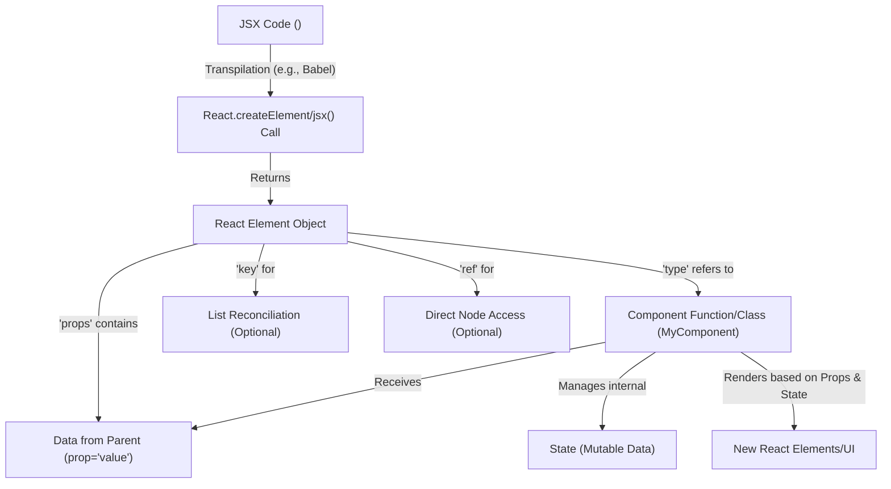

# 核心概念

要有效构建基于 React 的用户界面，理解其基本概念至关重要。本节将介绍 React 应用程序的核心构建模块，包括组件、JSX 语法、React 元素的作用以及数据如何通过 `props` 和 `state` 在应用程序中流动。这些概念对于创建结构化、动态和可维护的用户界面至关重要。

有关特定 React API 和 Hooks 的详细参考，请参阅[客户端 API](./client-apis.md) 和 [Hooks 参考](./client-apis-hooks.md) 部分。

## 组件

组件是 React 应用程序的核心。它们是独立、可复用的用户界面片段。React 主要支持两种定义组件的方式：类组件和函数组件。虽然现代 React 开发 heavily 倾向于使用带有 Hooks 的函数组件，但理解类组件能提供基础性见解。

### 类组件

类组件是继承自 `React.Component` 或 `React.PureComponent` 的 JavaScript 类。

-   **`Component`**: React 组件的基类。通过继承 `Component` 创建的组件管理其自身的内部 `state` 和生命周期方法。它们有一个 `props` 属性（用于从其父级传递的数据）和一个 `context` 属性。它们还有一个 `updater` 来处理 `state` 更新。
    -   **`setState(partialState, callback)`**: 此方法用于更新组件的 `state`。它接受一个对象或一个返回对象的函数，以及一个可选的回调函数，该回调函数在 `state` 更新完成后执行。`setState` 是异步的，这意味着调用后 `this.state` 可能不会立即更新。
    -   **`forceUpdate(callback)`**: 此方法强制组件重新渲染，绕过 `shouldComponentUpdate`。通常应谨慎使用此方法。

-   **`PureComponent`**: `Component` 的子类，它在 `shouldComponentUpdate` 中对 `props` 和 `state` 执行浅层比较。这意味着它只有在浅层比较确定 `props` 或 `state` 发生变化时才会重新渲染，这可能为特定用例带来性能优势。

`Component.prototype.isReactComponent` 和 `PureComponent.prototype.isPureReactComponent` 都是 React 用于识别有效组件类型的内部标记。

## JSX 和 React 元素

JSX (JavaScript XML) 是 React 推荐的 JavaScript 语法扩展。它允许您直接在 JavaScript 代码中编写类似 HTML 的结构。虽然它看起来像 HTML，但 JSX 是一种编译时转换，它将您的声明转换为对 `React.createElement`（在旧运行时或用于动态子元素）或 `React.jsx`/`React.jsxs`（在现代 JSX 运行时）的调用。

### React 元素

React 元素是一个普通的 JavaScript 对象，它描述了您希望在屏幕上看到的内容。它不是实际的 DOM 元素。相反，它是一个轻量级、不可变的用户界面组件实例描述。当 React 处理 JSX 时，它最终会生成这些元素对象。

React 元素的关键属性包括：

-   **`$$typeof`**: 一个符号（`Symbol.for('react.transitional.element')`），它唯一标识该对象为 React 元素，帮助 React 将其与其他 JavaScript 对象区分开来。
-   **`type`**: 指定元素的类型。它可以是一个字符串（用于 `'div'`、`'span'` 等 HTML 标签），一个 React 组件类，或一个函数组件。
-   **`props`**: 一个包含传递给组件的所有属性的对象，不包括 `key` 和 `ref`。
-   **`key`**: 在创建元素列表时使用的特殊字符串属性。React 使用 `key` 来识别哪些项已更改、已添加或已移除。`key` 在同级元素中必须是唯一的。
-   **`ref`**: 一个特殊属性，它提供了一种访问在渲染方法中创建的 DOM 节点或 React 元素的方式。

以下是 JSX 如何转换为 React 元素并与组件交互的概念流程：



## Props

`Props`（properties 的缩写）是只读数据，从父组件传递给其子组件。它们允许组件接收数据并根据该数据动态表现。组件在其函数签名中或通过类组件中的 `this.props` 接收 `props` 作为对象。组件上的 `defaultProps` 属性定义了在未显式提供 `props` 时的默认值。

## State

`State` 是一种数据结构，它保存了组件随时间变化的信息。与从父组件向下传递的 `props` 不同，`state` 由组件内部管理。当 `state` 更改时，组件会重新渲染以反映更新的信息。

对于类组件，`state` 在构造函数中初始化，并使用 `this.setState()` 更新。对于函数组件，使用 `useState` Hook 来管理 `state`。

## Keys

`Keys` 是特殊的字符串属性，用于帮助 React 识别列表中的项。当您渲染元素列表时，例如 `map` 遍历数组以创建 `<li>` 项列表时，您应该为每个元素分配一个唯一的 `key` prop。这使得 React 能够在列表更改时高效地更新、添加或移除项，从而提高性能并防止潜在的错误。

```javascript
// Example of using a key with an element
function ItemList({ items }) {
  return (
    <ul>
      {items.map(item => (
        <li key={item.id}>{item.name}</li>
      ))}
    </ul>
  );
}
```

React 内部使用 `checkKeyStringCoercion` 来确保 `key` prop 被正确地作为字符串处理。

## Refs

`Refs` 提供了一种直接访问在渲染方法中创建的 DOM 节点或 React 元素的方式。虽然与 React 元素的大多数交互是声明性的（通过 `props` 和 `state`），但 `refs` 提供了一种“逃生舱口”，用于需要直接访问的情况，例如管理焦点、文本选择或媒体播放，或与第三方 DOM 库集成。

-   **`createRef()`**: 一个创建 `ref` 对象的函数。此 `ref` 对象可以附加到 React 元素，其 `.current` 属性将在元素挂载后持有 DOM 节点或组件实例。
-   **`forwardRef()`**: 一个高阶组件，允许您将 `ref` 向下传递给子组件。当父组件需要与由子组件渲染的 DOM 元素交互时，这非常有用。

## Children

每个 React 组件都可以接收 `props.children`，这使得它们能够渲染从其父组件传递给它们的任意内容。这实现了组件组合，即组件可以包含其他组件或原始 HTML。

React 提供了用于处理 `props.children` 这种不透明数据结构的工具，允许您遍历、计数、映射或转换子元素。这些工具位于 `React.Children` 对象中，有关其详细信息，请参阅[实用工具](./client-apis-utilities.md) 部分。

理解这些核心概念为使用 React 构建复杂和交互式用户界面奠定了坚实的基础。通过结合组件，使用 `props` 和 `state` 管理数据，并利用 JSX 进行声明式用户界面开发，您可以创建健壮且可维护的应用程序。下一步是探索赋能 React 客户端应用程序开发的特定 API 和 Hooks。请继续前往[客户端 API](./client-apis.md) 部分了解更多信息。