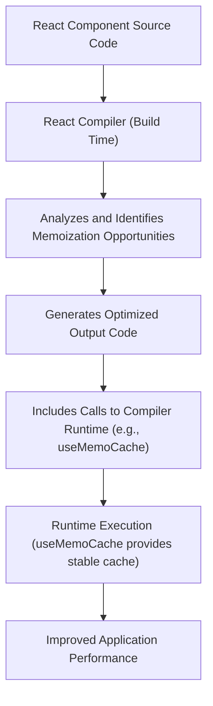

# Compiler Runtime

The React Compiler Runtime is a specialized component designed to work in conjunction with the React Compiler. Its primary function is to support compile-time performance optimizations, particularly for features like automatic memoization. This helps in enhancing the efficiency of React applications by reducing unnecessary re-renders.

For a broader understanding of performance and debugging tools, refer to the [Development and Optimization](./development-optimization.md) section.

## Core Functionality

The React Compiler aims to automate optimizations that developers typically perform manually, such as wrapping components or values with `memo` or `useMemo`. The Compiler Runtime provides the underlying mechanisms and specialized hooks required for these compiler-driven optimizations to function effectively at runtime.

### `useMemoCache`

The `useMemoCache` hook is a key export of the React Compiler Runtime. It is an internal hook primarily consumed by the React Compiler itself, rather than being called directly by developers in application code. Its purpose is to provide a stable, efficient cache for memoized values generated by the compiler.

When the React Compiler processes your components, it might identify opportunities to memoize values or components. Instead of generating boilerplate `useMemo` or `useCallback` calls, it leverages `useMemoCache` to manage and store these memoized results, ensuring consistency and performance.

**Hook Signature**

```javascript
export function useMemoCache(size: number): Array<mixed>
```

**Parameters**

| Name | Type | Description |
|---|---|---|
| `size` | `number` | The integer representing the desired capacity of the memoization cache. This dictates how many values the cache can hold for a given memoized computation. |

**Internal Implementation Snippet**

```javascript
// From src/ReactHooks.js
export function useMemoCache(size: number): Array<mixed> {
  const dispatcher = resolveDispatcher();
  // $FlowFixMe[not-a-function] This is unstable, thus optional
  return dispatcher.useMemoCache(size);
}
```

**Export Aliases**

For compatibility and internal usage, `useMemoCache` is also exported under specific aliases within the React Compiler Runtime packages:

| Alias | Purpose |
|---|---|
| `c` | Matches the typical export name from the `react/compiler-runtime` package, often used directly by the React Compiler. |
| `unstable_useMemoCache` | Provided for backward compatibility during transitions or experimental phases. |

**Export Snippet**

```javascript
// From src/ReactCompilerRuntime.js
export {useMemoCache as c} from './ReactHooks';

// From index.fb.js (illustrates aliasing)
export {useMemoCache as unstable_useMemoCache} from './src/ReactHooks';
export {useMemoCache as c} from './src/ReactHooks';
```

## How it Works with the React Compiler

Consider the following simplified flow when the React Compiler is in use:



The compiler automatically inserts calls to `useMemoCache` (or its `c` alias) in the compiled output. This eliminates the need for manual `useMemo` or `useCallback` calls, ensuring that memoization is applied consistently and efficiently across your application, based on the compiler's analysis.

## Conclusion

The React Compiler Runtime, particularly through its `useMemoCache` export, plays a critical role in enabling automatic, compile-time performance optimizations in React applications. While not a hook intended for direct developer use, understanding its existence helps in appreciating how the React Compiler enhances application efficiency.

To learn more about other tools and techniques for analyzing and improving your application's behavior, proceed to the [Debugging Utilities](./development-optimization-debugging.md) section.