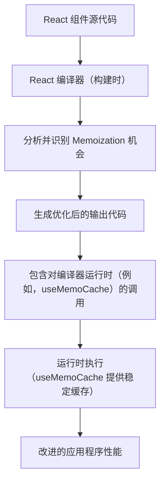

# 编译器运行时

React 编译器运行时是一个专门的组件，旨在与 React 编译器协同工作。其主要功能是支持编译时性能优化，特别是针对自动 memoization 等功能。这有助于通过减少不必要的重新渲染来提高 React 应用程序的效率。

有关性能和调试工具的更广泛理解，请参阅[开发和优化](./development-optimization.md)部分。

## 核心功能

React 编译器旨在自动化开发者通常手动执行的优化，例如使用 `memo` 或 `useMemo` 包装组件或值。编译器运行时提供这些由编译器驱动的优化在运行时有效运行所需的底层机制和专用 Hook。

### `useMemoCache`

`useMemoCache` Hook 是 React 编译器运行时的一个关键导出。它是一个内部 Hook，主要由 React 编译器本身使用，而不是由开发者在应用程序代码中直接调用。其目的是为编译器生成的 memoized 值提供一个稳定、高效的缓存。

当 React 编译器处理您的组件时，它可能会识别出 memoize 值或组件的机会。它不是生成样板 `useMemo` 或 `useCallback` 调用，而是利用 `useMemoCache` 来管理和存储这些 memoized 结果，从而确保一致性和性能。

**Hook 签名**

```javascript
export function useMemoCache(size: number): Array<mixed>
```

**参数**

| 名称 | 类型 | 描述 |
|---|---|---|
| `size` | `number` | 表示 memoization 缓存所需容量的整数。这决定了给定 memoized 计算的缓存可以容纳多少个值。 |

**内部实现代码片段**

```javascript
// From src/ReactHooks.js
export function useMemoCache(size: number): Array<mixed> {
  const dispatcher = resolveDispatcher();
  // $FlowFixMe[not-a-function] This is unstable, thus optional
  return dispatcher.useMemoCache(size);
}
```

**导出别名**

为了兼容性和内部使用，`useMemoCache` 在 React 编译器运行时包中也以特定别名导出：

| 别名 | 用途 |
|---|---|
| `c` | 匹配 `react/compiler-runtime` 包中的典型导出名称，通常由 React 编译器直接使用。 |
| `unstable_useMemoCache` | 在过渡或实验阶段提供，用于向后兼容。 |

**导出代码片段**

```javascript
// From src/ReactCompilerRuntime.js
export {useMemoCache as c} from './ReactHooks';

// From index.fb.js (illustrates aliasing)
export {useMemoCache as unstable_useMemoCache} from './src/ReactHooks';
export {useMemoCache as c} from './src/ReactHooks';
```

## 它如何与 React 编译器协同工作

当使用 React 编译器时，请考虑以下简化流程：



编译器会自动在编译输出中插入对 `useMemoCache`（或其 `c` 别名）的调用。这消除了手动 `useMemo` 或 `useCallback` 调用的需要，确保根据编译器的分析，在整个应用程序中一致且高效地应用 memoization。

## 总结

React 编译器运行时，特别是通过其 `useMemoCache` 导出，在 React 应用程序中实现自动的编译时性能优化方面发挥着关键作用。虽然它不是供开发者直接使用的 Hook，但了解它的存在有助于理解 React 编译器如何提高应用程序效率。

要了解有关分析和改进应用程序行为的其他工具和技术，请转到[调试工具](./development-optimization-debugging.md)部分。