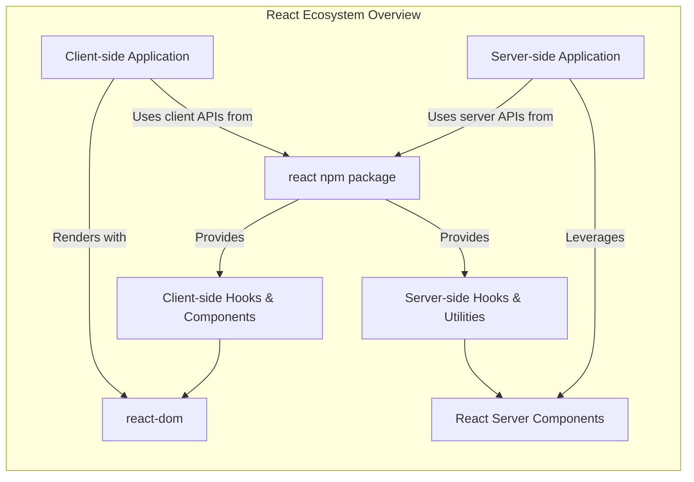

# Overview

React is a JavaScript library designed for efficiently building user interfaces. It enables developers to create interactive UIs by focusing on individual, reusable components.

## Core Principles

The `react` package provides the essential functionality for defining React components. It is typically used in conjunction with a specific renderer, such as `react-dom` for web applications or `react-native` for native mobile environments. This separation allows React to be a flexible foundation for various platforms, with the core logic for component definition remaining consistent across environments.

By default, React operates in a development mode, which includes helpful warnings for common mistakes. For deploying applications, it is crucial to use the production build, which includes performance optimizations and removes development-only error messages.

## Client-side and Server-side Runtimes

React applications can operate in distinct client-side and server-side runtimes, each optimized for its environment. The `react` package exports functionalities tailored to these specific contexts:

*   **Client-side Runtime**: Primarily used in web browsers, this runtime provides the standard set of React Hooks (like `useState`, `useEffect`) and component definitions necessary for building interactive user interfaces. It's the environment where UI updates respond directly to user interactions.
*   **Server-side Runtime**: Designed for React Server Components (RSC) and server-side rendering, this runtime offers specific hooks and utilities optimized for server-side operations, such as data fetching and initial page rendering. This allows for improved performance and SEO by pre-rendering parts of the UI on the server.

The `react` package intelligently exports the appropriate APIs based on whether it's imported in a client or server environment, ensuring that only relevant functionalities are available.



## Basic Usage

The following example demonstrates a minimal React component using the `useState` Hook from the `react` package and rendering it to the DOM using `react-dom`:

```js
import { useState } from 'react';
import { createRoot } from 'react-dom/client';

function Counter() {
  const [count, setCount] = useState(0);
  return (
    <>
      <h1>{count}</h1>
      <button onClick={() => setCount(count + 1)}>
        Increment
      </button>
    </>
  );
}

const root = createRoot(document.getElementById('root'));
root.render(<Counter />);
```
This code defines a `Counter` component that manages a `count` state, displays it, and provides a button to increment it. The component is then rendered into an HTML element with the ID `root`.

## Further Information

For more in-depth information, including comprehensive guides and detailed API references, visit the official React documentation:

*   [React Official Documentation](https://react.dev/)
*   [React API Reference](https://react.dev/reference/react)

---

This overview has introduced React's core purpose and its dual runtime architecture. To begin building your first React application, proceed to the [Getting Started](./getting-started.md) section.