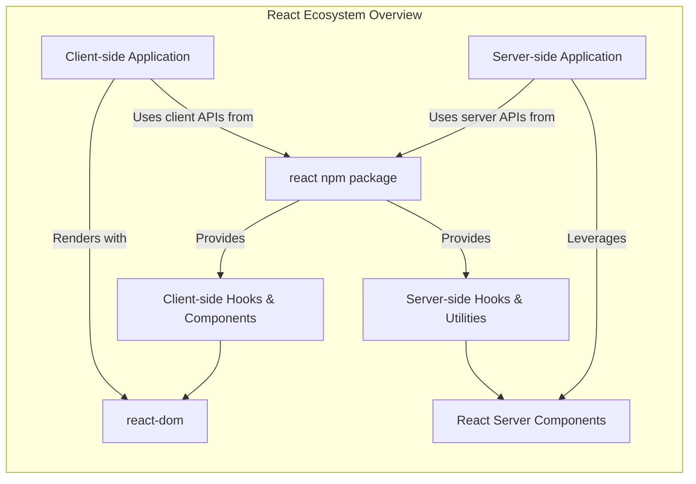

# 概述

React 是一个专门用于高效构建用户界面的 JavaScript 库。它使开发者能够通过专注于独立、可复用的组件来创建交互式 UI。

## 核心原则

`react` 包提供了定义 React 组件的基本功能。它通常与特定的渲染器结合使用，例如用于 Web 应用程序的 `react-dom` 或用于原生移动环境的 `react-native`。这种分离使得 React 成为一个灵活的跨平台基础，组件定义的核心逻辑在不同环境中保持一致。

默认情况下，React 在开发模式下运行，其中包括针对常见错误的有用警告。对于部署应用程序，使用生产版本至关重要，该版本包含性能优化并移除了仅用于开发环境的错误消息。

## 客户端和服务端运行时

React 应用程序可以在不同的客户端和服务端运行时中运行，每个运行时都针对其环境进行了优化。`react` 包导出了针对这些特定上下文定制的功能：

*   **客户端运行时**：主要用于 Web 浏览器，此运行时提供了一套标准的 React Hooks（如 `useState`、`useEffect`）和组件定义，这些是构建交互式用户界面所必需的。这是 UI 更新直接响应用户交互的环境。
*   **服务端运行时**：专为 React Server Components (RSC) 和服务端渲染而设计，此运行时提供了针对服务端操作（如数据获取和初始页面渲染）优化的特定 Hooks 和实用工具。这允许通过在服务器上预渲染部分 UI 来提高性能和 SEO。

`react` 包会根据是在客户端还是服务器环境中导入，智能地导出相应的 API，确保只有相关功能可用。



## 基本用法

以下示例展示了一个使用 `react` 包中的 `useState` Hook 并使用 `react-dom` 将其渲染到 DOM 的最小 React 组件：

```js
import { useState } from 'react';
import { createRoot } from 'react-dom/client';

function Counter() {
  const [count, setCount] = useState(0);
  return (
    <>
      <h1>{count}</h1>
      <button onClick={() => setCount(count + 1)}>
        Increment
      </button>
    </>
  );
}

const root = createRoot(document.getElementById('root'));
root.render(<Counter />);
```
此代码定义了一个 `Counter` 组件，该组件管理一个 `count` 状态，显示该状态，并提供一个按钮来递增它。然后，该组件被渲染到一个 ID 为 `root` 的 HTML 元素中。

## 更多信息

有关更深入的信息，包括全面的指南和详细的 API 参考，请访问 React 官方文档：

*   [React 官方文档](https://react.dev/)
*   [React API 参考](https://react.dev/reference/react)

---

本概述介绍了 React 的核心目的及其双运行时架构。要开始构建您的第一个 React 应用程序，请前往[入门](./getting-started.md)部分。
