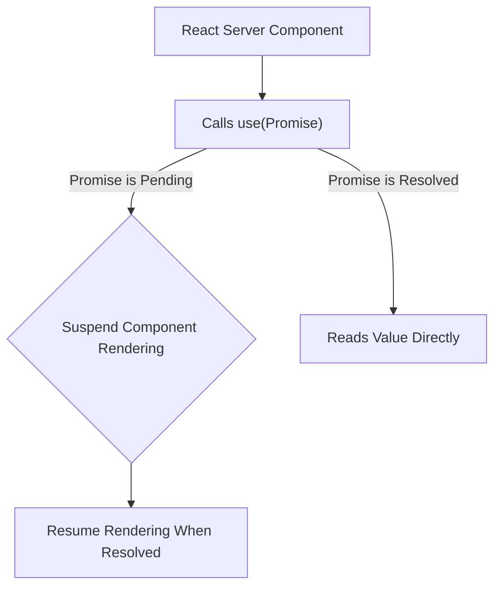
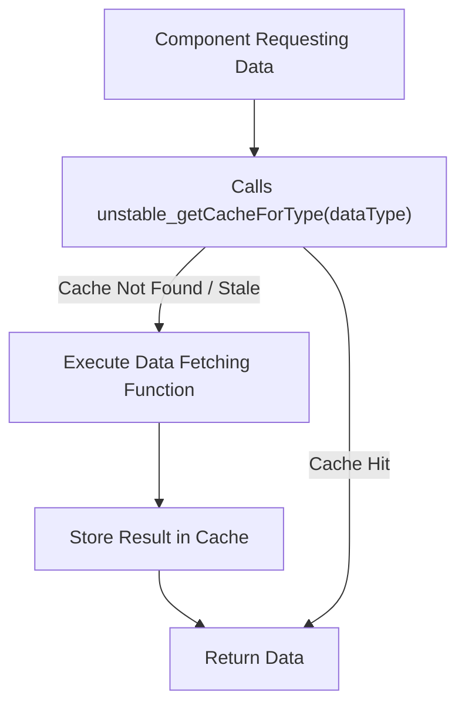

# Server Hooks

React Server Components allow developers to build performant server-side experiences. While traditional React Hooks like `useState` and `useEffect` are designed for interactive client-side components, a specific set of Hooks is available for use in server environments. These Hooks enable functionalities like data fetching, caching, and generating unique identifiers, optimized for the server-side rendering lifecycle.

This section details the Hooks you can leverage when building React Server Components. For a broader understanding of server-side APIs, refer to the [Server Components APIs](./server-components-apis.md) section. For general utilities available on the server, see [Server Utilities](./server-components-apis-utilities.md).

## use

The `use` Hook is a powerful addition that allows you to read the value of a resource, such as a Promise or Context, directly within your component's render logic. In React Server Components, this is particularly useful for asynchronous data fetching, enabling components to `await` data without needing client-side effects.



**Parameters**

| Name | Type | Description |
|---|---|---|
| `usable` | `Usable<T>` | The resource to read. This can be a Promise (for data fetching) or a Context (for shared data). |

**Returns**

| Name | Type | Description |
|---|---|---|
| `T` | `any` | The resolved value of the `usable` resource. |

**Example**

```jsx
// In a React Server Component (e.g., app/page.js)

async function fetchData() {
  const response = await fetch('https://api.example.com/data');
  return response.json();
}

const dataPromise = fetchData(); // Fetch data early, outside the component

export default function MyServerComponent() {
  const data = use(dataPromise); // Read the resolved data

  return (
    <div>
      <h1>Data from Server:</h1>
      <pre>{JSON.stringify(data, null, 2)}</pre>
    </div>
  );
}
```

In this example, `fetchData` is called outside the component to initiate the fetch early. Inside `MyServerComponent`, `use(dataPromise)` reads the resolved data. If the promise is still pending, React will suspend the component's rendering until the data is available, then stream the HTML. This pattern is efficient for server-side data fetching as it avoids client-side hydration delays.

## useId

The `useId` Hook generates a unique, stable ID that can be used to associate a label with an input field, or to provide unique identifiers for any element in the HTML. This is particularly beneficial for accessibility attributes like `aria-labelledby` or `htmlFor`, ensuring they are unique across the rendered HTML, which is crucial in server-rendered environments where multiple instances of a component might appear.

**Parameters**

None.

**Returns**

| Name | Type | Description |
|---|---|---|
| `string` | `string` | A unique string ID. |

**Example**

```jsx
import { useId } from 'react';

export default function SignupForm() {
  const emailId = useId();
  const passwordId = useId();

  return (
    <form>
      <div>
        <label htmlFor={emailId}>Email:</label>
        <input id={emailId} type="email" name="email" />
      </div>
      <div>
        <label htmlFor={passwordId}>Password:</label>
        <input id={passwordId} type="password" name="password" />
      </div>
      <button type="submit">Sign Up</button>
    </form>
  );
}
```

Here, `useId` ensures that the `id` attributes for the email and password inputs, and their corresponding `htmlFor` attributes on the labels, are unique within the rendered HTML, even if `SignupForm` is rendered multiple times on the same page.

## useCallback

The `useCallback` Hook memoizes a function, returning a memoized version of the callback that only changes if one of the `deps` (dependencies) has changed. In React Server Components, while direct interaction is not present, `useCallback` can still be useful for preventing unnecessary re-creation of functions passed as props to child components (especially if those children are client components or are processed in a way that benefits from stable function references).

**Parameters**

| Name | Type | Description |
|---|---|---|
| `callback` | `T` | The function to memoize. |
| `deps` | `Array<mixed> \| void \| null` | An array of dependencies. The function will only be re-created if any of these dependencies change. If an empty array `[]` is provided, the function will only be created once. |

**Returns**

| Name | Type | Description |
|---|---|---|
| `T` | `Function` | The memoized function. |

**Example**

```jsx
import { useCallback } from 'react';

function ClientButton({ onClick }) {
  // This component is assumed to be a client component
  return <button onClick={onClick}>Click Me</button>;
}

export default function ParentServerComponent({ param }) {
  const handleClick = useCallback(() => {
    console.log(`Button clicked with param: ${param}`);
  }, [param]); // The handleClick function will only change if 'param' changes

  // When rendering ClientButton from a Server Component, if onClick is a stable reference,
  // it can optimize hydration or serialization for client components.
  return <ClientButton onClick={handleClick} />;
}
```

This example demonstrates how `useCallback` can be used in a server component to memoize a function that might be passed down to a client component. The `handleClick` function will only be redefined if `param` changes, providing a stable reference that can be beneficial for reconciliation or serialization processes.

## useDebugValue

The `useDebugValue` Hook is a development-only Hook that displays a custom label for custom Hooks in React DevTools. It is intended to assist in debugging and understanding the internal state of custom Hooks during development.

**Parameters**

| Name | Type | Description |
|---|---|---|
| `value` | `T` | The value to display in the DevTools. |
| `formatterFn` | `?(value: T) => mixed` | An optional formatting function that takes the value and returns a formatted display value. This function is only called when DevTools are open. |

**Returns**

| Name | Type | Description |
|---|---|---|
| `void` | `void` | This Hook does not return a value. |

**Example**

```jsx
import { useDebugValue, useState } from 'react';

// A custom hook (can be used in client or server components)
function useLogger(initialValue) {
  const [value, setValue] = useState(initialValue);

  // Displays 'useLogger: Current Value: <value>' in DevTools
  useDebugValue(value, val => `Current Value: ${val}`);

  return [value, setValue];
}

export default function ServerComponentWithLogger() {
  const [data, setData] = useLogger('Initial Data');

  // In a real server component, state wouldn't be dynamic in the same way,
  // but useDebugValue demonstrates its purpose for custom hook development.
  return (
    <div>
      <p>Data from custom hook: {data}</p>
      {/* Server components don't have interactive state updates */}
    </div>
  );
}
```

This example shows `useDebugValue` within a `useLogger` custom Hook. When inspecting components that use `useLogger` in React DevTools during development, you will see a custom label (`Current Value: <value>`) that provides insight into the value managed by the hook.

## useMemo

The `useMemo` Hook memoizes the result of an expensive computation, recomputing it only when one of its dependencies changes. This can optimize performance by avoiding redundant calculations. In server components, `useMemo` can be used to prevent re-running costly data transformations or object creations on every render, which is beneficial for reducing server processing time.

**Parameters**

| Name | Type | Description |
|---|---|---|
| `create` | `() => T` | The function that computes the value to be memoized. |
| `deps` | `Array<mixed> \| void \| null` | An array of dependencies. The value will only be recomputed if any of these dependencies change. If an empty array `[]` is provided, the value will only be computed once. |

**Returns**

| Name | Type | Description |
|---|---|---|
| `T` | `any` | The memoized value. |

**Example**

```jsx
import { useMemo } from 'react';

function calculateExpensiveResult(input) {
  // Simulate an expensive computation
  let result = 0;
  for (let i = 0; i < 1000000; i++) {
    result += input * i;
  }
  return result;
}

export default function OptimizedServerComponent({ userId }) {
  const userSpecificData = useMemo(() => {
    // This calculation only runs if userId changes
    return calculateExpensiveResult(userId);
  }, [userId]);

  return (
    <div>
      <h1>User Data Summary</h1>
      <p>Calculated result for user {userId}: {userSpecificData}</p>
    </div>
  );
}
```

In this example, `calculateExpensiveResult` is a CPU-intensive function. By wrapping its call within `useMemo`, the `userSpecificData` will only be re-calculated if the `userId` prop changes, preventing redundant computations during re-renders caused by other factors.

## unstable_getCacheForType

The `unstable_getCacheForType` Hook provides a mechanism to access a type-specific cache. This is particularly relevant in server environments for managing and optimizing data access patterns. This Hook is currently unstable, indicating its API may change in future React releases.



**Parameters**

| Name | Type | Description |
|---|---|---|
| `resourceType` | `() => T` | A function that defines the type of resource. This function will be called once to initialize the cache for this type if it doesn't already exist. |

**Returns**

| Name | Type | Description |
|---|---|---|
| `T` | `any` | The cached instance of the resource type. |

**Example**

```jsx
import { unstable_getCacheForType } from 'react';

// Define a cache for user data
const UserCache = () => {
  const cache = new Map();
  return {
    getUser: async (id) => {
      if (!cache.has(id)) {
        const response = await fetch(`https://api.example.com/users/${id}`);
        const userData = await response.json();
        cache.set(id, userData);
      }
      return cache.get(id);
    },
  };
};

export default async function UserProfile({ userId }) {
  // Access the user cache instance for this request
  const userCache = unstable_getCacheForType(UserCache);
  const user = await userCache.getUser(userId);

  return (
    <div>
      <h1>User Profile</h1>
      <p>Name: {user.name}</p>
      <p>Email: {user.email}</p>
    </div>
  );
}
```

This example demonstrates how `unstable_getCacheForType` can be used to create and access a shared cache (`UserCache`) for user data within a server component. When `UserProfile` is rendered, it retrieves the `UserCache` instance for the current request. Subsequent calls to `getUser` for the same `userId` within the same request will hit the cache, avoiding redundant network requests and improving performance.

---

This section provided a detailed overview of the React Hooks available for server-side component development. These Hooks are essential for optimizing performance and managing data within the server rendering context. Next, explore the [Taint Registry](./server-components-apis-taint-registry.md) to understand how to prevent sensitive server-side data from inadvertently exposing to client components.