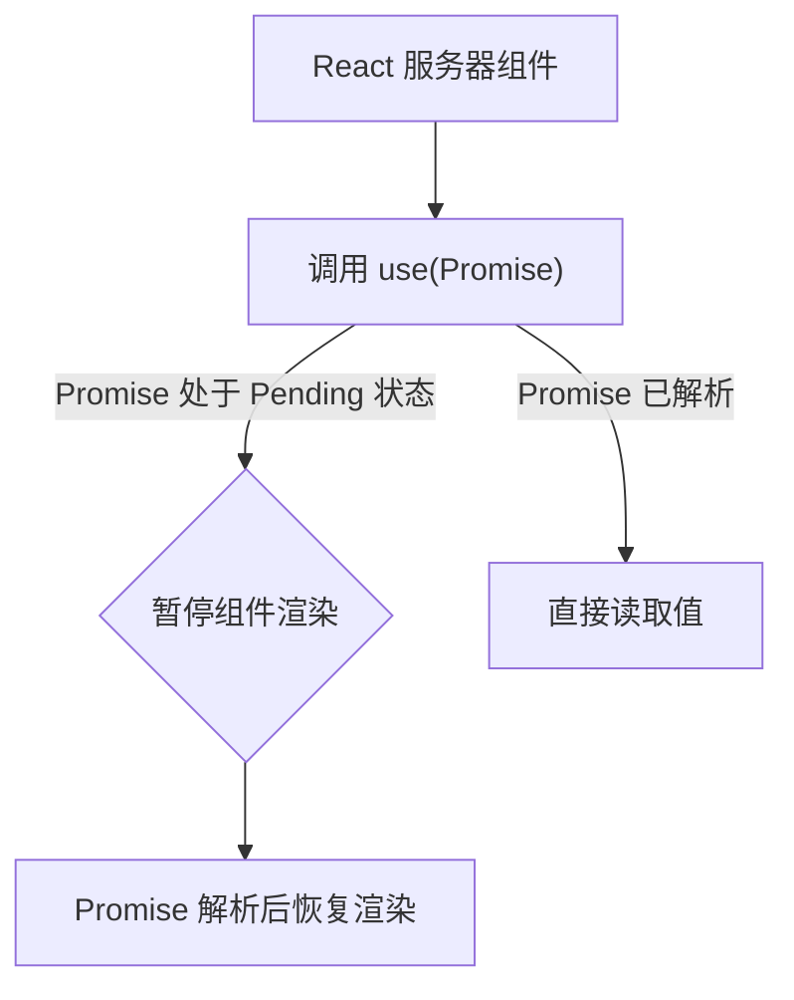
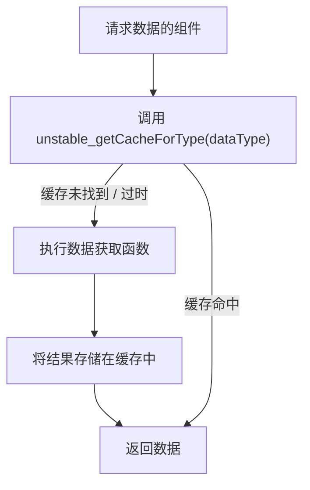

# 服务器 Hooks

React 服务器组件允许开发者构建高性能的服务器端体验。虽然 `useState` 和 `useEffect` 等传统 React Hooks 专为交互式客户端组件设计，但有一组特定的 Hooks 可用于服务器环境。这些 Hooks 支持数据获取、缓存和生成唯一标识符等功能，并针对服务器端渲染生命周期进行了优化。

本节详细介绍了在构建 React 服务器组件时可以利用的 Hooks。要更全面地了解服务器端 API，请参阅[服务器组件 API](./server-components-apis.md) 部分。有关服务器上可用的通用工具，请参阅[服务器工具](./server-components-apis-utilities.md)。

## use

`use` Hook 是一个强大的新增功能，它允许您直接在组件的渲染逻辑中读取资源（例如 Promise 或 Context）的值。在 React 服务器组件中，这对于异步数据获取特别有用，使组件无需客户端副作用即可 `await` 数据。



**参数**

| 名称 | 类型 | 描述 |
|---|---|---|
| `usable` | `Usable<T>` | 要读取的资源。这可以是 Promise（用于数据获取）或 Context（用于共享数据）。 |

**返回值**

| 名称 | 类型 | 描述 |
|---|---|---|
| `T` | `any` | `usable` 资源的已解析值。 |

**示例**

```jsx
// 在 React 服务器组件中 (例如, app/page.js)

async function fetchData() {
  const response = await fetch('https://api.example.com/data');
  return response.json();
}

const dataPromise = fetchData(); // 在组件外部尽早获取数据

export default function MyServerComponent() {
  const data = use(dataPromise); // 读取已解析的数据

  return (
    <div>
      <h1>来自服务器的数据:</h1>
      <pre>{JSON.stringify(data, null, 2)}</pre>
    </div>
  );
}
```

在此示例中，`fetchData` 在组件外部调用以尽早启动数据获取。在 `MyServerComponent` 内部，`use(dataPromise)` 读取已解析的数据。如果 Promise 仍处于 pending 状态，React 将暂停组件的渲染，直到数据可用，然后流式传输 HTML。此模式对于服务器端数据获取很高效，因为它避免了客户端水合延迟。

## useId

`useId` Hook 生成一个唯一、稳定的 ID，可用于将标签与输入字段关联，或为 HTML 中的任何元素提供唯一标识符。这对于 `aria-labelledby` 或 `htmlFor` 等可访问性属性特别有益，可确保它们在渲染的 HTML 中保持唯一性，这在可能出现组件多个实例的服务器渲染环境中至关重要。

**参数**

无。

**返回值**

| 名称 | 类型 | 描述 |
|---|---|---|
| `string` | `string` | 唯一的字符串 ID。 |

**示例**

```jsx
import { useId } from 'react';

export default function SignupForm() {
  const emailId = useId();
  const passwordId = useId();

  return (
    <form>
      <div>
        <label htmlFor={emailId}>Email:</label>
        <input id={emailId} type="email" name="email" />
      </div>
      <div>
        <label htmlFor={passwordId}>Password:</label>
        <input id={passwordId} type="password" name="password" />
      </div>
      <button type="submit">Sign Up</button>
    </form>
  );
}
```

在此示例中，`useId` 确保电子邮件和密码输入的 `id` 属性及其标签上相应的 `htmlFor` 属性在渲染的 HTML 中是唯一的，即使 `SignupForm` 在同一页面上多次渲染也是如此。

## useCallback

`useCallback` Hook 记忆化函数，返回回调函数的记忆化版本，该版本仅在 `deps`（依赖项）之一发生变化时才变化。在 React 服务器组件中，尽管不存在直接交互，但 `useCallback` 仍然可以用于防止将函数作为 props 传递给子组件时进行不必要的重新创建（特别是如果这些子组件是客户端组件，或者以受益于稳定函数引用的方式进行处理）。

**参数**

| 名称 | 类型 | 描述 |
|---|---|---|
| `callback` | `T` | 要记忆化的函数。 |
| `deps` | `Array<mixed> \| void \| null` | 依赖项数组。仅当这些依赖项中的任何一个发生变化时，函数才会重新创建。如果提供空数组 `[]`，函数将只创建一次。 |

**返回值**

| 名称 | 类型 | 描述 |
|---|---|---|
| `T` | `Function` | 记忆化函数。 |

**示例**

```jsx
import { useCallback } from 'react';

function ClientButton({ onClick }) {
  // 此组件被假定为客户端组件
  return <button onClick={onClick}>Click Me</button>;
}

export default function ParentServerComponent({ param }) {
  const handleClick = useCallback(() => {
    console.log(`Button clicked with param: ${param}`);
  }, [param]); // handleClick 函数仅在 'param' 变化时才变化

  // 当从服务器组件渲染 ClientButton 时，如果 onClick 是一个稳定引用，
  // 它可以优化客户端组件的水合或序列化。
  return <ClientButton onClick={handleClick} />;
}
```

此示例演示了 `useCallback` 如何在服务器组件中用于记忆化可能传递给客户端组件的函数。`handleClick` 函数仅在 `param` 发生变化时才重新定义，从而提供了一个稳定引用，这对于协调或序列化过程可能是有益的。

## useDebugValue

`useDebugValue` Hook 是一个仅用于开发环境的 Hook，它在 React DevTools 中为自定义 Hook 显示自定义标签。它旨在帮助在开发过程中调试和理解自定义 Hook 的内部状态。

**参数**

| 名称 | 类型 | 描述 |
|---|---|---|
| `value` | `T` | 要在 DevTools 中显示的值。 |
| `formatterFn` | `?(value: T) => mixed` | 一个可选的格式化函数，它接受该值并返回格式化的显示值。此函数仅在 DevTools 打开时调用。 |

**返回值**

| 名称 | 类型 | 描述 |
|---|---|---|
| `void` | `void` | 此 Hook 不返回任何值。 |

**示例**

```jsx
import { useDebugValue, useState } from 'react';

// 一个自定义 Hook (可在客户端或服务器组件中使用)
function useLogger(initialValue) {
  const [value, setValue] = useState(initialValue);

  // 在 DevTools 中显示 'useLogger: Current Value: <value>'
  useDebugValue(value, val => `Current Value: ${val}`);

  return [value, setValue];
}

export default function ServerComponentWithLogger() {
  const [data, setData] = useLogger('Initial Data');

  // 在真实的服务器组件中，状态不会以相同的方式动态变化，
  // 但 useDebugValue 演示了其用于自定义 Hook 开发的目的。
  return (
    <div>
      <p>来自自定义 Hook 的数据: {data}</p>
      {/* 服务器组件没有交互式状态更新 */}
    </div>
  );
}
```

此示例展示了 `useDebugValue` 在 `useLogger` 自定义 Hook 中的用法。在开发过程中检查使用 `useLogger` 的组件时，您将在 React DevTools 中看到一个自定义标签（`Current Value: <value>`），它提供了对 Hook 管理的值的深入了解。

## useMemo

`useMemo` Hook 记忆化昂贵计算的结果，仅当其依赖项之一发生变化时才重新计算。这可以通过避免冗余计算来优化性能。在服务器组件中，`useMemo` 可用于防止在每次渲染时重新运行昂贵的数据转换或对象创建，这有利于减少服务器处理时间。

**参数**

| 名称 | 类型 | 描述 |
|---|---|---|
| `create` | `() => T` | 计算要记忆化的值的函数。 |
| `deps` | `Array<mixed> \| void \| null` | 依赖项数组。仅当这些依赖项中的任何一个发生变化时，该值才会重新计算。如果提供空数组 `[]`，该值将只计算一次。 |

**返回值**

| 名称 | 类型 | 描述 |
|---|---|---|
| `T` | `any` | 记忆化值。 |

**示例**

```jsx
import { useMemo } from 'react';

function calculateExpensiveResult(input) {
  // 模拟一个昂贵的计算
  let result = 0;
  for (let i = 0; i < 1000000; i++) {
    result += input * i;
  }
  return result;
}

export default function OptimizedServerComponent({ userId }) {
  const userSpecificData = useMemo(() => {
    // 此计算仅在 userId 变化时运行
    return calculateExpensiveResult(userId);
  }, [userId]);

  return (
    <div>
      <h1>用户数据摘要</h1>
      <p>用户 {userId} 的计算结果: {userSpecificData}</p>
    </div>
  );
}
```

在此示例中，`calculateExpensiveResult` 是一个 CPU 密集型函数。通过将其调用包装在 `useMemo` 中，`userSpecificData` 将仅在 `userId` prop 变化时才重新计算，从而防止因其他因素引起的重新渲染期间的冗余计算。

## unstable_getCacheForType

`unstable_getCacheForType` Hook 提供了一种访问特定类型缓存的机制。这在服务器环境中对于管理和优化数据访问模式特别相关。此 Hook 目前不稳定，表明其 API 在未来的 React 版本中可能会发生变化。



**参数**

| 名称 | 类型 | 描述 |
|---|---|---|
| `resourceType` | `() => T` | 定义资源类型的函数。如果此类型的缓存尚不存在，则此函数将被调用一次以初始化该缓存。 |

**返回值**

| 名称 | 类型 | 描述 |
|---|---|---|
| `T` | `any` | 资源类型的缓存实例。 |

**示例**

```jsx
import { unstable_getCacheForType } from 'react';

// 定义用户数据缓存
const UserCache = () => {
  const cache = new Map();
  return {
    getUser: async (id) => {
      if (!cache.has(id)) {
        const response = await fetch(`https://api.example.com/users/${id}`);
        const userData = await response.json();
        cache.set(id, userData);
      }
      return cache.get(id);
    },
  };
};

export default async function UserProfile({ userId }) {
  // 访问此请求的用户缓存实例
  const userCache = unstable_getCacheForType(UserCache);
  const user = await userCache.getUser(userId);

  return (
    <div>
      <h1>用户资料</h1>
      <p>姓名: {user.name}</p>
      <p>电子邮件: {user.email}</p>
    </div>
  );
}
```

此示例演示了如何在服务器组件中使用 `unstable_getCacheForType` 创建和访问用于用户数据的共享缓存（`UserCache`）。当 `UserProfile` 渲染时，它会为当前请求检索 `UserCache` 实例。对同一请求中相同 `userId` 的 `getUser` 后续调用将命中缓存，从而避免冗余网络请求并提高性能。

---

本节详细概述了可用于服务器端组件开发的 React Hooks。这些 Hooks 对于在服务器渲染上下文中优化性能和管理数据至关重要。接下来，请探索[污点注册表](./server-components-apis-taint-registry.md)，了解如何防止敏感的服务器端数据无意中暴露给客户端组件。
