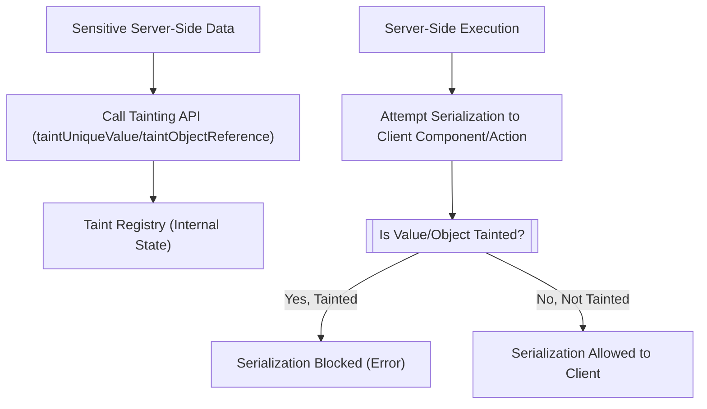

# Taint Registry

The Taint Registry is a critical security mechanism in React Server Components, designed to prevent sensitive server-side values from inadvertently leaking to the client. This feature helps maintain data integrity and security by ensuring that any value marked as 'tainted' on the server cannot be serialized and exposed to a Client Component or Action closure.

For more information on the overall capabilities of React Server Components APIs, refer to the [Server Components APIs](./server-components-apis.md) section.

## Why Use the Taint Registry?

In applications that leverage React Server Components, certain data might be sensitive and should strictly remain on the server. Examples include API keys, database credentials, or personally identifiable information (PII). Without proper safeguards, such sensitive data could accidentally be included in the serialized payload sent to the client, leading to security vulnerabilities. The Taint Registry provides a programmatic way to mark these values, allowing React to automatically block their serialization, thereby preventing potential data exposure.

## How the Taint Registry Works

The Taint Registry operates by maintaining an internal record of values and objects that have been designated as sensitive. When React attempts to serialize data for a Client Component or an Action, it checks this registry. If a value or object (or a reference to it) is found in the registry, React prevents its serialization and throws an error, indicating a data leak attempt.

The core of the Taint Registry consists of:

*   `TaintRegistryObjects`: A `WeakMap` that stores references to tainted objects and functions, along with their associated messages.
*   `TaintRegistryValues`: A `Map` that holds unique tainted primitive values (like strings and bigints) or string representations of binary data, along with their messages and a reference count.
*   `FinalizationRegistry`: Used (if available in the environment) to automatically clean up `TaintRegistryValues` entries when the associated 'lifetime' object is garbage collected, helping manage memory.

The following diagram illustrates the general flow of how sensitive data is managed with the Taint Registry:



## API Reference

React provides two experimental APIs for tainting values and objects:

### experimental_taintUniqueValue

Use `experimental_taintUniqueValue` to mark unique primitive values or binary data as tainted. This prevents these specific values from being serialized and sent to the client.

**Parameters**

| Name | Type | Description |
|---|---|---|
| `message` | `string` | Optional. A message describing why the value is tainted. If not provided, a default message is used. |
| `lifetime` | `Reference` | A JavaScript object or function whose lifetime is tied to the tainted value. When this `lifetime` object is garbage collected, the tainted value may eventually be removed from the registry. This parameter must be an object or function, not `null`. |
| `value` | `string \| bigint \| $ArrayBufferView` | The specific value to taint. Supported types are `string`, `bigint`, or binary data (`TypedArray` or `DataView`). Other types will cause an error. |

**Outcome**

This function does not return a value. It registers the provided `value` as tainted in the internal `TaintRegistryValues` map. If the value is already tainted, its internal reference count is incremented.

**Cautions**

*   Throws an `Error` if `enableTaint` is not active.
*   Throws an `Error` if `lifetime` is `null` or not an object/function.
*   Throws an `Error` if `value` is an object, function, or other general primitive (like `number` or `boolean`), as `taintUniqueValue` is designed for unique, globally blockable values.

**Example**

```javascript
import {experimental_taintUniqueValue} from 'react-server-dom-webpack/server';

function sensitiveCalculation(secretKey) {
  // Assume secretKey is a sensitive string
  experimental_taintUniqueValue(
    'Secret key should not leave the server.',
    this, // Or any object whose lifetime defines the taint scope
    secretKey,
  );
  // Perform calculation
  return 'calculated result';
}

// Example with binary data (e.g., a token)
const sensitiveToken = new Uint8Array([1, 2, 3, 4, 5]);
experimental_taintUniqueValue(
  'Binary token must not be sent to client.',
  sensitiveToken, // Using the token itself as the lifetime object
  sensitiveToken,
);

// Any attempt to serialize `secretKey` or `sensitiveToken` to the client
// (e.g., by including it in props of a Client Component or a closure for a Server Action)
// will result in a runtime error.
```

This example demonstrates how to taint a sensitive string (`secretKey`) and a `Uint8Array` (`sensitiveToken`). If these values are ever included in data sent to a Client Component or Action, React will block the serialization and throw an error.

### experimental_taintObjectReference

Use `experimental_taintObjectReference` to mark a specific object or function reference as tainted. This ensures that the object itself, or any reference to it, cannot be serialized to the client.

**Parameters**

| Name | Type | Description |
|---|---|---|
| `message` | `string` | Optional. A message describing why the object is tainted. If not provided, a default message is used. |
| `object` | `Reference` | The JavaScript object or function to mark as tainted. This must be an object or a function, not a primitive value or `null`. |

**Outcome**

This function does not return a value. It registers the provided `object` as tainted in the internal `TaintRegistryObjects` `WeakMap`. Subsequent attempts to serialize this specific object reference will be blocked.

**Cautions**

*   Throws an `Error` if `enableTaint` is not active.
*   Throws an `Error` if `object` is `null`, a primitive value (like `string` or `bigint`), or not an object/function. For primitive values, `experimental_taintUniqueValue` should be used instead.

**Example**

```javascript
import {experimental_taintObjectReference} from 'react-server-dom-webpack/server';

const sensitiveDataSource = {
  dbConnection: '...', // database connection details
  apiKey: 'xyz123', // sensitive API key
  // ... other sensitive properties
};

experimental_taintObjectReference(
  'Database connection object contains sensitive credentials.',
  sensitiveDataSource,
);

function fetchData() {
  // Use sensitiveDataSource internally on the server
  console.log('Fetching data using:', sensitiveDataSource.apiKey);
  // ...
}

// If sensitiveDataSource object is passed directly or indirectly
// into a Client Component's props or captured by an Action closure, 
// React will prevent its serialization and throw an error.
```

This example demonstrates tainting an entire `sensitiveDataSource` object. Any attempt to serialize this specific object to the client will be blocked, even if only a reference to it is passed.

## Conclusion

The Taint Registry is an essential security feature in React Server Components, providing a robust mechanism to prevent sensitive server-side data from inadvertently being exposed to the client. By explicitly marking unique values or object references as tainted, developers can ensure data integrity and mitigate potential security risks. Properly utilizing `experimental_taintUniqueValue` and `experimental_taintObjectReference` helps maintain a secure boundary between server and client environments.

To learn more about other server-side functionalities, proceed to the [Server Hooks](./server-components-apis-hooks.md) section.