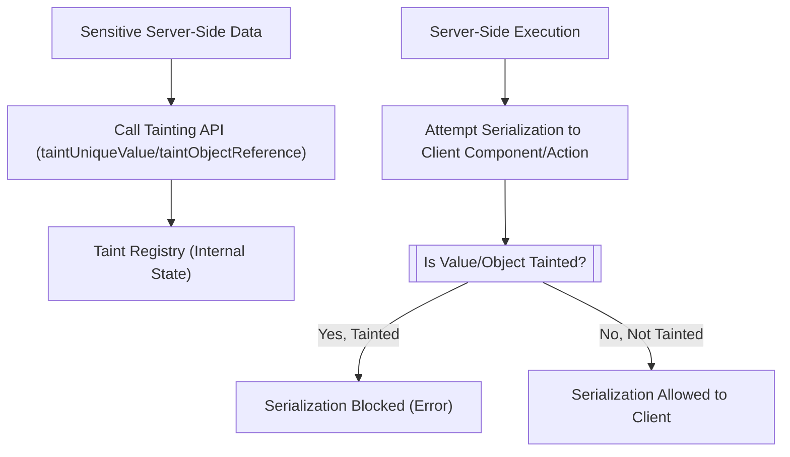

# 污染注册表

污染注册表是 React Server Components 中一项关键的安全机制，旨在防止敏感的服务器端值无意中泄漏到客户端。此功能通过确保任何在服务器端标记为“污染”的值都无法被序列化并暴露给客户端组件或 Action 闭包，从而有助于维护数据完整性和安全性。

有关 React Server Components API 整体功能的更多信息，请参阅[服务器组件 API](./server-components-apis.md)部分。

## 为何使用污染注册表？

在使用 React Server Components 的应用程序中，某些数据可能很敏感，应严格保留在服务器上。示例包括 API 密钥、数据库凭据或个人身份信息 (PII)。如果没有适当的保护措施，此类敏感数据可能会意外地包含在发送到客户端的序列化负载中，从而导致安全漏洞。污染注册表提供了一种以编程方式标记这些值的方法，允许 React 自动阻止其序列化，从而防止潜在的数据暴露。

## 污染注册表工作原理

污染注册表通过维护内部记录来操作，这些记录包含已被指定为敏感的值和对象。当 React 尝试为客户端组件或 Action 序列化数据时，它会检查此注册表。如果在注册表中找到值或对象（或对其的引用），React 将阻止其序列化并抛出错误，指示存在数据泄漏尝试。

污染注册表的核心包括：

*   `TaintRegistryObjects`：一个 `WeakMap`，用于存储污染对象和函数的引用，以及它们关联的消息。
*   `TaintRegistryValues`：一个 `Map`，用于保存唯一的污染原始值（如字符串和 bigint）或二进制数据的字符串表示，以及它们的消息和引用计数。
*   `FinalizationRegistry`：用于（如果环境中可用）在关联的“生命周期”对象被垃圾回收时自动清理 `TaintRegistryValues` 条目，有助于内存管理。

下图说明了使用污染注册表管理敏感数据的通用流程：



## API 参考

React 提供了两个用于污染值和对象的实验性 API：

### experimental_taintUniqueValue

使用 `experimental_taintUniqueValue` 将唯一的原始值或二进制数据标记为污染。这可以防止这些特定值被序列化并发送到客户端。

**参数**

| Name | Type | Description |
|---|---|---|
| `message` | `string` | 可选。描述值为何被污染的消息。如果未提供，则使用默认消息。 |
| `lifetime` | `Reference` | 一个 JavaScript 对象或函数，其生命周期与污染值相关联。当此 `lifetime` 对象被垃圾回收时，污染值最终可能会从注册表中移除。此参数必须是一个对象或函数，不能是 `null`。 |
| `value` | `string \| bigint \| $ArrayBufferView` | 要污染的特定值。支持的类型是 `string`、`bigint` 或二进制数据（`TypedArray` 或 `DataView`）。其他类型将导致错误。 |

**结果**

此函数不返回值。它将提供给定的 `value` 注册为内部 `TaintRegistryValues` map 中的污染值。如果该值已被污染，则其内部引用计数会递增。

**注意事项**

*   如果 `enableTaint` 未激活，则抛出 `Error`。
*   如果 `lifetime` 为 `null` 或不是对象/函数，则抛出 `Error`。
*   如果 `value` 是对象、函数或其他通用原始类型（如 `number` 或 `boolean`），则抛出 `Error`，因为 `taintUniqueValue` 旨在用于唯一、全局可阻塞的值。

**示例**

```javascript
import {experimental_taintUniqueValue} from 'react-server-dom-webpack/server';

function sensitiveCalculation(secretKey) {
  // Assume secretKey is a sensitive string
  experimental_taintUniqueValue(
    'Secret key should not leave the server.',
    this, // Or any object whose lifetime defines the taint scope
    secretKey,
  );
  // Perform calculation
  return 'calculated result';
}

// Example with binary data (e.g., a token)
const sensitiveToken = new Uint8Array([1, 2, 3, 4, 5]);
experimental_taintUniqueValue(
  'Binary token must not be sent to client.',
  sensitiveToken, // Using the token itself as the lifetime object
  sensitiveToken,
);

// Any attempt to serialize `secretKey` or `sensitiveToken` to the client
// (e.g., by including it in props of a Client Component or a closure for a Server Action)
// will result in a runtime error.
```

此示例演示了如何污染敏感字符串（`secretKey`）和 `Uint8Array`（`sensitiveToken`）。如果这些值被包含在发送到客户端组件或 Action 的数据中，React 将阻止序列化并抛出错误。

### experimental_taintObjectReference

使用 `experimental_taintObjectReference` 将特定对象或函数引用标记为污染。这确保了对象本身或对其的任何引用都无法序列化到客户端。

**参数**

| Name | Type | Description |
|---|---|---|
| `message` | `string` | 可选。描述对象为何被污染的消息。如果未提供，则使用默认消息。 |
| `object` | `Reference` | 要标记为污染的 JavaScript 对象或函数。这必须是一个对象或函数，不能是原始值或 `null`。 |

**结果**

此函数不返回值。它将提供给定的 `object` 注册为内部 `TaintRegistryObjects` `WeakMap` 中的污染值。此后尝试序列化此特定对象引用将被阻止。

**注意事项**

*   如果 `enableTaint` 未激活，则抛出 `Error`。
*   如果 `object` 为 `null`、原始值（如 `string` 或 `bigint`）或不是对象/函数，则抛出 `Error`。对于原始值，应改用 `experimental_taintUniqueValue`。

**示例**

```javascript
import {experimental_taintObjectReference} from 'react-server-dom-webpack/server';

const sensitiveDataSource = {
  dbConnection: '...', // database connection details
  apiKey: 'xyz123', // sensitive API key
  // ... other sensitive properties
};

experimental_taintObjectReference(
  'Database connection object contains sensitive credentials.',
  sensitiveDataSource,
);

function fetchData() {
  // Use sensitiveDataSource internally on the server
  console.log('Fetching data using:', sensitiveDataSource.apiKey);
  // ...
}

// If sensitiveDataSource object is passed directly or indirectly
// into a Client Component's props or captured by an Action closure, 
// React will prevent its serialization and throw an error.
```

此示例演示了如何污染整个 `sensitiveDataSource` 对象。任何尝试将此特定对象序列化到客户端的操作都将被阻止，即使只传递了对其的引用。

## 总结

污染注册表是 React Server Components 中一项重要的安全功能，提供了一种强大的机制来防止敏感的服务器端数据无意中暴露给客户端。通过明确地将唯一值或对象引用标记为污染，开发者可以确保数据完整性并降低潜在的安全风险。正确利用 `experimental_taintUniqueValue` 和 `experimental_taintObjectReference` 有助于维护服务器和客户端环境之间的安全边界。

要了解更多服务器端功能，请继续阅读 [服务器 Hook](./server-components-apis-hooks.md) 部分。