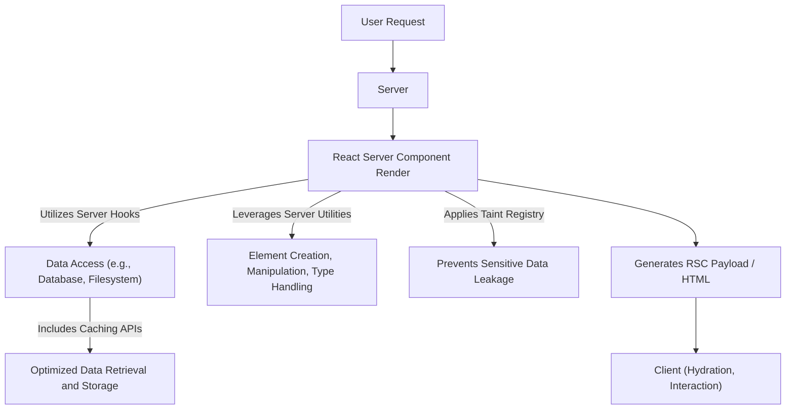

# Server Components APIs

React Server Components (RSC) introduce a new paradigm for building performant React applications by allowing components to render on the server. This approach enables direct database access, secure handling of sensitive data, and reduced client-side JavaScript bundles. The APIs available within React Server Components are specifically designed to leverage the server environment, providing capabilities distinct from traditional client-side React.

This section provides an overview of the core APIs available for building React Server Components. For detailed information on specific categories, refer to the dedicated sub-sections:

*   [Server Hooks](./server-components-apis-hooks.md)
*   [Server Utilities](./server-components-apis-utilities.md)
*   [Taint Registry](./server-components-apis-taint-registry.md)

## Understanding Server Component API Interactions

React Server Components execute on the server, allowing them to directly access server-side resources and APIs. This flow contrasts with client components, which rely on network requests to fetch data. Server Component APIs facilitate efficient data fetching, caching, and handling of sensitive information before the component's output is streamed to the client.



## Server Hooks

React Server Components provide a subset of Hooks that are optimized for server-side execution, primarily focusing on data management and unique identifier generation. These hooks allow you to manage state, memoize computations, and interact with the server environment without impacting client-side bundle size or performance.

Key Server Hooks include:

*   `use`: For reading values from contexts or unwrapping Promises directly within components, simplifying asynchronous data handling.
*   `useId`: Generates unique IDs that are stable across the server and client, essential for accessibility attributes.
*   `useCallback`: Memoizes callback functions to prevent unnecessary re-creations.
*   `useMemo`: Memoizes computationally expensive functions, caching their results for performance.
*   `useDebugValue`: A development-only hook that allows you to display a custom label for custom Hooks in React DevTools.
*   `unstable_getCacheForType`: An experimental API for accessing and managing caches.
*   `startTransition`: An experimental API for marking UI updates as non-urgent, allowing for responsive UI during large re-renders.
*   `unstable_postpone`: An experimental API to intentionally defer rendering of parts of the UI, useful for server-side rendering when data is not yet available.

For an in-depth look at each server-side hook, including usage examples and best practices, visit the [Server Hooks](./server-components-apis-hooks.md) section.

## Server Utilities

Beyond Hooks, React Server Components expose a set of utility functions and built-in components that facilitate common tasks like manipulating React elements, managing component types, and interacting with children props. These utilities are crucial for constructing and optimizing the server-rendered output.

Notable Server Utilities include:

*   `Children`: An object providing utilities for working with `props.children`, such as `map`, `forEach`, `count`, `toArray`, and `only`.
*   `createElement`: Creates and returns a new React element.
*   `cloneElement`: Clones and returns a new React element using an existing element as the starting point.
*   `createRef`: Creates a ref object that can be attached to React elements via the `ref` attribute.
*   `forwardRef`: Allows components to expose a ref to their children.
*   `Fragment`: A built-in component that lets you group a list of children without adding extra nodes to the DOM.
*   `isValidElement`: Verifies whether an object is a React element.
*   `lazy`: Lets you defer loading of a component’s code until it’s rendered for the first time.
*   `memo`: A higher-order component that memoizes a functional component to prevent unnecessary re-renders.
*   `Profiler`: A component for measuring rendering performance of a React tree.
*   `StrictMode`: A development-only tool for highlighting potential problems in an application.
*   `Suspense`: A component that lets you “wait” for some code to load and declaratively specify a loading state.
*   `cache`: Allows memoizing function calls on the server, leveraging a cache unique to the current React context.
*   `cacheSignal`: Provides an AbortSignal that aborts when the current React cache boundary is invalidated.
*   `version`: Provides the current version of React.
*   `captureOwnerStack`: (Development-only) Captures the owner stack for debugging purposes.
*   `unstable_SuspenseList`: An experimental component for coordinating the loading order of multiple Suspense components.
*   `unstable_ViewTransition`: An experimental component related to managing UI transitions, typically for single-page applications.
*   `unstable_Activity`: An experimental component for marking parts of the UI that are currently active or undergoing a transition.

For comprehensive details on how to use these utilities effectively, proceed to the [Server Utilities](./server-components-apis-utilities.md) section.

## Taint Registry

The Taint Registry is an experimental security feature in React Server Components designed to prevent the accidental leakage of sensitive server-side data to client components. It allows developers to explicitly mark specific values or object references as tainted, ensuring they cannot be inadvertently serialized and sent to the client. This mechanism is crucial for maintaining data confidentiality and preventing security vulnerabilities in applications that leverage Server Components.

The Taint Registry provides two primary functions for marking data:

### `experimental_taintUniqueValue`

This function marks a unique value as tainted. Once a value is tainted, React will prevent its serialization to client components or action closures, thus mitigating potential data leakage. This function is suitable for primitive values or buffer views that represent unique, sensitive data.

**Parameters**

| Name | Type | Description |
|---:|:---|:---|
| `message` | `?string` | An optional message explaining why the value is tainted. Defaults to a generic message if not provided. |
| `lifetime` | `object` \| `function` | An object or function whose lifetime determines how long the taint is active. When this `lifetime` object is garbage collected, the taint for the associated `value` is cleaned up. This must be an object or function, not `null`. |
| `value` | `string` \| `bigint` \| `ArrayBufferView` | The unique value to be tainted. Supported types are `string`, `bigint`, or any `ArrayBufferView` (e.g., `Uint8Array`, `DataView`). Other types of objects or functions cannot be tainted with this function; use `experimental_taintObjectReference` instead. |

**Example**

```javascript
import { experimental_taintUniqueValue } from 'react'; // Or your specific React Server Components entry point

function ServerComponent({ authToken }) {
  // Mark the authToken string as tainted, associating its lifetime with a simple object.
  // A more complex object (e.g., a specific database query result object) could be used for lifetime.
  experimental_taintUniqueValue(
    'Auth token should not be sent to the client.',
    {}, 
    authToken
  );

  return (
    // ... render server component content, ensuring authToken is not directly passed to client components
  );
}
```

This example demonstrates how to taint a unique authentication token string. If this `authToken` were ever attempted to be serialized to a client component, React would throw an error, preventing the leakage.

### `experimental_taintObjectReference`

This function marks an entire object reference as tainted. Any attempt to serialize this specific object instance to a client component or action closure will result in an error.

**Parameters**

| Name | Type | Description |
|---:|:---|:---|
| `message` | `?string` | An optional message explaining why the object is tainted. Defaults to a generic message if not provided. |
| `object` | `object` \| `function` | The object or function reference to be tainted. This must be an object or function, not `null`, a string, or a bigint. |

**Example**

```javascript
import { experimental_taintObjectReference } from 'react'; // Or your specific React Server Components entry point

const databaseClient = connectToDatabase(); // A sensitive database client object

function ServerComponent() {
  // Mark the entire databaseClient object as tainted.
  experimental_taintObjectReference(
    'Database client should never be exposed to the client.',
    databaseClient
  );

  // ... server-side operations using databaseClient
  return (
    // ... render server component content
  );
}
```

This example shows how to taint a `databaseClient` object. Any attempt to pass this `databaseClient` instance to a client component directly would be blocked by React's Taint Registry.

It's important to note that the Taint Registry is an experimental feature enabled by the `enableTaint` flag. Its behavior, especially regarding garbage collection and cleanup, relies on the `FinalizationRegistry` API when available. Developers should use these functions to explicitly protect sensitive server-side data from inadvertent exposure.

## Next Steps

This section provided a high-level overview of the APIs available in React Server Components, including a brief look at Server Hooks, Server Utilities, and the Taint Registry. For more in-depth information and practical examples for each category, explore the dedicated sections:

*   [Server Hooks](./server-components-apis-hooks.md)
*   [Server Utilities](./server-components-apis-utilities.md)
*   [Taint Registry](./server-components-apis-taint-registry.md)