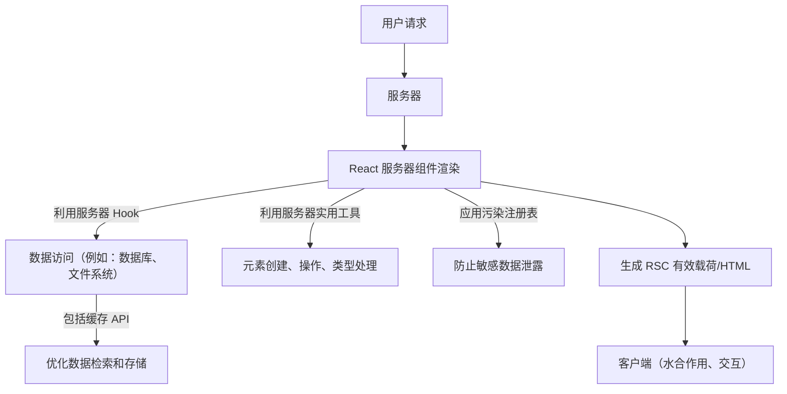

# 服务器组件 API

React 服务器组件 (RSC) 引入了一种构建高性能 React 应用的新范式，它允许组件在服务器上渲染。这种方法实现了直接数据库访问、安全处理敏感数据以及减少客户端 JavaScript 包大小。React 服务器组件中可用的 API 专门设计用于利用服务器环境，提供与传统客户端 React 不同的能力。

本节概述了构建 React 服务器组件的核心 API。有关特定类别的详细信息，请参阅专门的小节：

*   [服务器 Hook](./server-components-apis-hooks.md)
*   [服务器实用工具](./server-components-apis-utilities.md)
*   [污染注册表](./server-components-apis-taint-registry.md)

## 理解服务器组件 API 交互

React 服务器组件在服务器上执行，允许它们直接访问服务器端资源和 API。这种流程与依赖网络请求获取数据的客户端组件形成对比。服务器组件 API 促进了在组件输出流式传输到客户端之前高效的数据获取、缓存和敏感信息处理。



## 服务器 Hook

React 服务器组件提供了一部分 Hook，这些 Hook 针对服务器端执行进行了优化，主要侧重于数据管理和唯一标识符生成。这些 Hook 允许您管理状态、记忆计算并与服务器环境交互，而不影响客户端包大小或性能。

主要服务器 Hook 包括：

*   `use`: 用于从上下文中读取值或直接在组件内解包 Promise，简化异步数据处理。
*   `useId`: 生成在服务器和客户端之间稳定的唯一 ID，对于辅助功能属性至关重要。
*   `useCallback`: 记忆回调函数以防止不必要的重新创建。
*   `useMemo`: 记忆计算成本高昂的函数，缓存其结果以提高性能。
*   `useDebugValue`: 一个仅供开发使用的 Hook，允许您在 React DevTools 中为自定义 Hook 显示自定义标签。
*   `unstable_getCacheForType`: 一个用于访问和管理缓存的实验性 API。
*   `startTransition`: 一个用于将 UI 更新标记为非紧急的实验性 API，在大规模重新渲染期间允许响应式 UI。
*   `unstable_postpone`: 一个实验性 API，用于有意推迟部分 UI 的渲染，在数据尚不可用时对服务器端渲染很有用。

有关每个服务器端 Hook 的深入了解，包括使用示例和最佳实践，请访问 [服务器 Hook](./server-components-apis-hooks.md) 部分。

## 服务器实用工具

除了 Hook 之外，React 服务器组件还公开了一组实用函数和内置组件，它们有助于执行常见任务，例如操作 React 元素、管理组件类型以及与子 props 交互。这些实用工具对于构建和优化服务器渲染输出至关重要。

值得注意的服务器实用工具包括：

*   `Children`: 一个提供用于处理 `props.children` 的实用工具对象，例如 `map`、`forEach`、`count`、`toArray` 和 `only`。
*   `createElement`: 创建并返回一个新的 React 元素。
*   `cloneElement`: 克隆并返回一个以现有元素为起点的新 React 元素。
*   `createRef`: 创建一个 ref 对象，可以通过 `ref` 属性附加到 React 元素。
*   `forwardRef`: 允许组件向其子组件公开一个 ref。
*   `Fragment`: 一个内置组件，允许您将子组件列表分组，而无需向 DOM 添加额外的节点。
*   `isValidElement`: 验证对象是否为 React 元素。
*   `lazy`: 允许您推迟组件代码的加载，直到它首次渲染。
*   `memo`: 一个高阶组件，用于记忆功能组件以防止不必要的重新渲染。
*   `Profiler`: 一个用于测量 React 树渲染性能的组件。
*   `StrictMode`: 一个仅供开发使用的工具，用于突出显示应用程序中潜在的问题。
*   `Suspense`: 一个允许您“等待”某些代码加载并声明性地指定加载状态的组件。
*   `cache`: 允许在服务器上记忆函数调用，利用当前 React 上下文中唯一的缓存。
*   `cacheSignal`: 提供一个 AbortSignal，当当前 React 缓存边界失效时中止。
*   `version`: 提供当前 React 版本。
*   `captureOwnerStack`: （仅限开发）捕获所有者堆栈以用于调试目的。
*   `unstable_SuspenseList`: 一个用于协调多个 Suspense 组件加载顺序的实验性组件。
*   `unstable_ViewTransition`: 一个与管理 UI 过渡相关的实验性组件，通常用于单页应用程序。
*   `unstable_Activity`: 一个用于标记当前活动或正在进行过渡的 UI 部分的实验性组件。

有关如何有效使用这些实用工具的全面详细信息，请继续阅读 [服务器实用工具](./server-components-apis-utilities.md) 部分。

## 污染注册表

污染注册表是 React 服务器组件中的一项实验性安全功能，旨在防止敏感服务器端数据意外泄露到客户端组件。它允许开发者显式地将特定值或对象引用标记为受污染的，从而确保它们不会在无意中被序列化并发送到客户端。此机制对于维护数据机密性并防止利用服务器组件的应用程序中的安全漏洞至关重要。

污染注册表提供两个主要的数据标记功能：

### `experimental_taintUniqueValue`

此函数将唯一值标记为受污染的。一旦值被污染，React 将阻止其序列化到客户端组件或操作闭包，从而减轻潜在的数据泄露。此函数适用于表示唯一敏感数据的原始值或缓冲区视图。

**参数**

| Name | Type | Description |
|---:|:---|:---|
| `message` | `?string` | 一个可选消息，解释值被污染的原因。如果未提供，则默认为通用消息。 |
| `lifetime` | `object` \| `function` | 一个对象或函数，其生命周期决定污染的活跃时间。当此 `lifetime` 对象被垃圾回收时，关联 `value` 的污染将被清除。这必须是一个对象或函数，而不是 `null`。 |
| `value` | `string` \| `bigint` \| `ArrayBufferView` | 要污染的唯一值。支持的类型有 `string`、`bigint` 或任何 `ArrayBufferView`（例如 `Uint8Array`、`DataView`）。此函数不能污染其他类型的对象或函数；请改用 `experimental_taintObjectReference`。 |

**示例**

```javascript
import { experimental_taintUniqueValue } from 'react'; // 或您的特定 React 服务器组件入口点

function ServerComponent({ authToken }) {
  // 将 authToken 字符串标记为受污染的，将其生命周期与一个简单对象关联。
  // 更复杂的对象（例如，特定的数据库查询结果对象）可用于生命周期。
  experimental_taintUniqueValue(
    'Auth token should not be sent to the client.',
    {}, 
    authToken
  );

  return (
    // ... 渲染服务器组件内容，确保 authToken 不会直接传递给客户端组件
  );
}
```

此示例演示了如何污染唯一的认证令牌字符串。如果此 `authToken` 被尝试序列化到客户端组件，React 将抛出错误，从而防止泄露。

### `experimental_taintObjectReference`

此函数将整个对象引用标记为受污染的。任何尝试将此特定对象实例序列化到客户端组件或操作闭包都会导致错误。

**参数**

| Name | Type | Description |
|---:|:---|:---|
| `message` | `?string` | 一个可选消息，解释对象被污染的原因。如果未提供，则默认为通用消息。 |
| `object` | `object` \| `function` | 要污染的对象或函数引用。这必须是一个对象或函数，而不是 `null`、字符串或 bigint。 |

**示例**

```javascript
import { experimental_taintObjectReference } from 'react'; // 或您的特定 React 服务器组件入口点

const databaseClient = connectToDatabase(); // 一个敏感的数据库客户端对象

function ServerComponent() {
  // 将整个 databaseClient 对象标记为受污染的。
  experimental_taintObjectReference(
    'Database client should never be exposed to the client.',
    databaseClient
  );

  // ... 使用 databaseClient 进行服务器端操作
  return (
    // ... 渲染服务器组件内容
  );
}
```

此示例展示了如何污染 `databaseClient` 对象。任何尝试将此 `databaseClient` 实例直接传递给客户端组件的操作都将受到 React 污染注册表的阻止。

值得注意的是，污染注册表是一个由 `enableTaint` 标志启用的实验性功能。其行为，特别是在垃圾回收和清理方面，在可用时依赖于 `FinalizationRegistry` API。开发者应使用这些函数来显式保护敏感的服务器端数据免受意外暴露。

## 后续步骤

本节提供了 React 服务器组件中可用 API 的高级概述，包括简要介绍了服务器 Hook、服务器实用工具和污染注册表。有关每个类别的更深入信息和实际示例，请探索专门的小节：

*   [服务器 Hook](./server-components-apis-hooks.md)
*   [服务器实用工具](./server-components-apis-utilities.md)
*   [污染注册表](./server-components-apis-taint-registry.md)